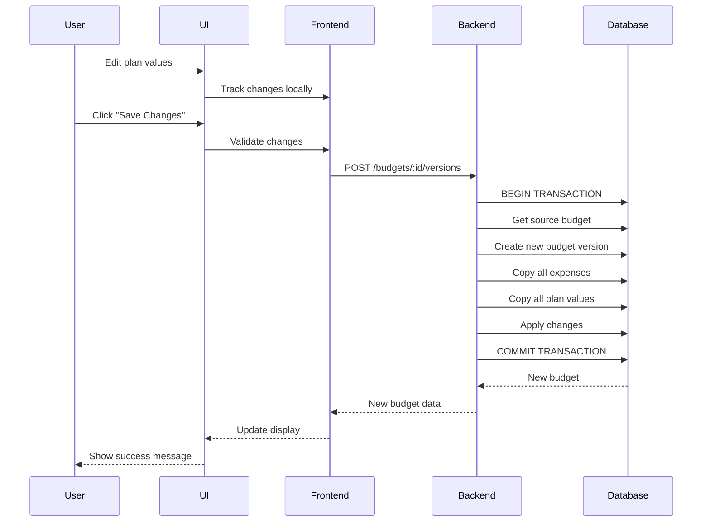
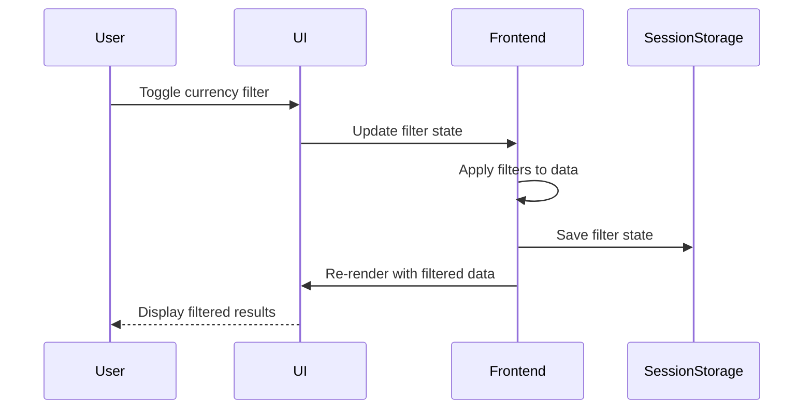

# Design Document: Budget Management System Improvements

## Overview

Este diseño especifica las mejoras al sistema de gestión de presupuesto existente, enfocándose en tres áreas principales:

1. **Navegación y Filtros Mejorados**: Implementación de un menú lateral izquierdo y filtros toggle para monedas y empresas financieras con aplicación dinámica
2. **Edición Dinámica de Valores Planeados**: Sistema de edición inline con versionamiento automático de presupuestos
3. **Gestión Completa de Transacciones**: Interfaces dedicadas para gestionar transacciones comprometidas y reales

El sistema mantiene la arquitectura existente de Node.js + Express + Prisma en el backend y React + TypeScript + Tailwind CSS en el frontend.

## Architecture

### High-Level Architecture

```
┌─────────────────────────────────────────────────────────────┐
│                        Frontend (React)                      │
├─────────────────────────────────────────────────────────────┤
│  ┌──────────────┐  ┌──────────────┐  ┌──────────────┐      │
│  │   Sidebar    │  │ Filter Panel │  │ Plan Editor  │      │
│  │  Component   │  │  (Toggles)   │  │  Component   │      │
│  └──────────────┘  └──────────────┘  └──────────────┘      │
│                                                               │
│  ┌──────────────┐  ┌──────────────┐  ┌──────────────┐      │
│  │ Transaction  │  │ Transaction  │  │   Budget     │      │
│  │  Committed   │  │    Real      │  │  Versioning  │      │
│  └──────────────┘  └──────────────┘  └──────────────┘      │
├─────────────────────────────────────────────────────────────┤
│                      API Layer (Axios)                       │
└─────────────────────────────────────────────────────────────┘
                              │
                              ▼
┌─────────────────────────────────────────────────────────────┐
│                    Backend (Express + Prisma)                │
├─────────────────────────────────────────────────────────────┤
│  ┌──────────────┐  ┌──────────────┐  ┌──────────────┐      │
│  │   Budget     │  │  PlanValue   │  │ Transaction  │      │
│  │   Service    │  │   Service    │  │   Service    │      │
│  └──────────────┘  └──────────────┘  └──────────────┘      │
│                                                               │
│  ┌──────────────┐  ┌──────────────┐                         │
│  │   Expense    │  │   Filter     │                         │
│  │   Service    │  │   Service    │                         │
│  └──────────────┘  └──────────────┘                         │
├─────────────────────────────────────────────────────────────┤
│                    Prisma ORM Layer                          │
└─────────────────────────────────────────────────────────────┘
                              │
                              ▼
┌─────────────────────────────────────────────────────────────┐
│                    PostgreSQL Database                       │
└─────────────────────────────────────────────────────────────┘
```

### Design Principles

1. **Separation of Concerns**: UI components, business logic, and data access are clearly separated
2. **Immutability**: Budget versions are immutable; changes create new versions
3. **Referential Integrity**: All transactions must reference valid expenses
4. **Automatic Calculations**: USD values are calculated automatically based on conversion rates
5. **Optimistic UI Updates**: UI updates immediately with local state, then syncs with backend

## Components and Interfaces

### Frontend Components

#### 1. Sidebar Component

**Purpose**: Provides left-side navigation menu for all application sections

**Props**:
```typescript
interface SidebarProps {
  currentSection: string;
  onNavigate: (section: string) => void;
}
```

**State**:
```typescript
interface SidebarState {
  isCollapsed: boolean;
  activeSection: string;
}
```

**Navigation Sections**:
- Dashboard
- Budget Planning
- Committed Transactions
- Real Transactions
- Master Data
- Reports

#### 2. FilterPanel Component

**Purpose**: Displays toggle buttons for currency and financial company filters

**Props**:
```typescript
interface FilterPanelProps {
  currencies: string[];
  financialCompanies: FinancialCompany[];
  activeFilters: FilterState;
  onFilterChange: (filters: FilterState) => void;
}
```

**State**:
```typescript
interface FilterState {
  activeCurrencies: Set<string>;
  activeFinancialCompanies: Set<string>;
}
```

**Behavior**:
- Toggle buttons for each currency and financial company
- Visual indication of active filters (highlighted state)
- Immediate application of filter changes
- "Clear All" button to reset filters

#### 3. PlanValueEditor Component

**Purpose**: Provides inline editing of plan values with automatic versioning

**Props**:
```typescript
interface PlanValueEditorProps {
  budgetId: string;
  expenses: Expense[];
  planValues: PlanValue[];
  onSave: (changes: PlanValueChange[]) => Promise<void>;
}
```

**State**:
```typescript
interface PlanValueEditorState {
  editingCell: { expenseId: string; month: number } | null;
  pendingChanges: Map<string, PlanValueChange>;
  validationErrors: Map<string, string>;
}

interface PlanValueChange {
  expenseId: string;
  month: number;
  oldValue: number;
  newValue: number;
  currency: string;
}
```

**Behavior**:
- Click on cell to enable inline editing
- Validate numeric input with decimal precision
- Highlight modified cells
- Batch changes and save on confirmation
- Trigger budget version creation on save

#### 4. TransactionManager Component

**Purpose**: Manages committed and real transactions with CRUD operations

**Props**:
```typescript
interface TransactionManagerProps {
  type: 'COMMITTED' | 'REAL';
  budgetId: string;
  expenses: Expense[];
  onTransactionChange: () => void;
}
```

**State**:
```typescript
interface TransactionManagerState {
  transactions: Transaction[];
  editingTransaction: Transaction | null;
  isAddingNew: boolean;
  validationErrors: Record<string, string>;
}
```

**Behavior**:
- Display transactions in sortable table
- Inline editing of existing transactions
- Add new transaction form
- Delete with confirmation dialog
- Validate expense association and data integrity

#### 5. BudgetVersionManager Component

**Purpose**: Handles budget version creation and management

**Props**:
```typescript
interface BudgetVersionManagerProps {
  currentBudget: Budget;
  onVersionCreated: (newBudget: Budget) => void;
}
```

**Methods**:
```typescript
interface BudgetVersionManager {
  createNewVersion(changes: PlanValueChange[]): Promise<Budget>;
  addExpenseToBudget(expenseId: string): Promise<void>;
  removeExpenseFromBudget(expenseId: string): Promise<void>;
}
```

### Backend Services

#### 1. BudgetService (Enhanced)

**New Methods**:

```typescript
class BudgetService {
  /**
   * Creates a new budget version by copying all data from previous version
   * and applying plan value changes
   */
  async createNewVersion(
    sourceBudgetId: string,
    planValueChanges: PlanValueChange[]
  ): Promise<Budget>;

  /**
   * Adds an existing expense to a budget version
   */
  async addExpenseToBudget(
    budgetId: string,
    expenseCode: string
  ): Promise<Expense>;

  /**
   * Removes an expense from a budget version
   */
  async removeExpenseFromBudget(
    budgetId: string,
    expenseId: string
  ): Promise<void>;

  /**
   * Gets the next version number for a budget year
   */
  async getNextVersion(year: number): Promise<string>;
}
```

**Version Naming Strategy**:
- Format: `v{major}.{minor}`
- Example: `v1.0`, `v1.1`, `v2.0`
- Increment minor version for plan value changes
- Increment major version for structural changes (add/remove expenses)

#### 2. FilterService (New)

**Purpose**: Handles filter logic and data filtering

```typescript
class FilterService {
  /**
   * Applies currency and financial company filters to expenses
   */
  filterExpenses(
    expenses: Expense[],
    filters: FilterCriteria
  ): Expense[];

  /**
   * Validates filter criteria
   */
  validateFilters(filters: FilterCriteria): ValidationResult;
}

interface FilterCriteria {
  currencies: string[];
  financialCompanyIds: string[];
}
```

#### 3. PlanValueService (Enhanced)

**New Methods**:

```typescript
class PlanValueService {
  /**
   * Batch update plan values for a budget version
   */
  async batchUpdatePlanValues(
    budgetId: string,
    changes: PlanValueChange[]
  ): Promise<PlanValue[]>;

  /**
   * Copy all plan values from one budget to another
   */
  async copyPlanValues(
    sourceBudgetId: string,
    targetBudgetId: string
  ): Promise<PlanValue[]>;

  /**
   * Initialize plan values for a new expense (all months = 0)
   */
  async initializePlanValues(
    expenseId: string,
    currency: string
  ): Promise<PlanValue[]>;
}
```

#### 4. TransactionService (Enhanced)

**New Methods**:

```typescript
class TransactionService {
  /**
   * Get all transactions by type for a budget
   */
  async getTransactionsByType(
    budgetId: string,
    type: TransactionType
  ): Promise<Transaction[]>;

  /**
   * Batch create transactions
   */
  async batchCreateTransactions(
    transactions: TransactionInput[]
  ): Promise<Transaction[]>;

  /**
   * Validate transaction against expense and budget
   */
  async validateTransaction(
    transaction: TransactionInput
  ): Promise<ValidationResult>;
}
```

### API Endpoints

#### Budget Versioning Endpoints

```
POST   /api/budgets/:id/versions
  Body: { planValueChanges: PlanValueChange[] }
  Response: Budget

POST   /api/budgets/:id/expenses
  Body: { expenseCode: string }
  Response: Expense

DELETE /api/budgets/:id/expenses/:expenseId
  Response: { success: boolean }
```

#### Plan Value Endpoints

```
PATCH  /api/budgets/:id/plan-values/batch
  Body: { changes: PlanValueChange[] }
  Response: PlanValue[]

GET    /api/expenses/:id/plan-values
  Response: PlanValue[]
```

#### Transaction Endpoints

```
GET    /api/budgets/:id/transactions?type=COMMITTED|REAL
  Response: Transaction[]

POST   /api/transactions
  Body: TransactionInput
  Response: Transaction

PATCH  /api/transactions/:id
  Body: Partial<TransactionInput>
  Response: Transaction

DELETE /api/transactions/:id
  Response: { success: boolean }

POST   /api/transactions/batch
  Body: { transactions: TransactionInput[] }
  Response: Transaction[]
```

#### Filter Endpoints

```
GET    /api/budgets/:id/expenses/filtered?currencies=USD,EUR&companies=id1,id2
  Response: Expense[]
```

## Data Models

### Existing Models (No Changes)

The existing Prisma schema remains unchanged:
- Budget
- Expense
- Transaction
- PlanValue
- ConversionRate
- FinancialCompany
- TechnologyDirection
- UserArea
- TagDefinition
- TagValue

### Frontend State Models

#### Filter State

```typescript
interface FilterState {
  activeCurrencies: Set<string>;
  activeFinancialCompanies: Set<string>;
}
```

**Storage**: Browser sessionStorage for persistence across navigation

**Key**: `budget-filters-${budgetId}`

#### Plan Value Change Tracking

```typescript
interface PlanValueChange {
  expenseId: string;
  month: number;
  oldValue: number;
  newValue: number;
  currency: string;
}

interface PlanValueChangeSet {
  budgetId: string;
  changes: Map<string, PlanValueChange>; // key: `${expenseId}-${month}`
  timestamp: Date;
}
```

**Storage**: Component state (React useState)

#### Transaction Form State

```typescript
interface TransactionFormData {
  expenseId: string;
  type: 'COMMITTED' | 'REAL';
  serviceDate: Date;
  postingDate: Date;
  referenceDocumentNumber: string;
  externalPlatformLink: string;
  transactionCurrency: string;
  transactionValue: number;
  month: number;
}
```

### Data Flow Diagrams

#### Budget Version Creation Flow



#### Filter Application Flow



## Correctness Properties

*A property is a characteristic or behavior that should hold true across all valid executions of a system—essentially, a formal statement about what the system should do. Properties serve as the bridge between human-readable specifications and machine-verifiable correctness guarantees.*


### Property 1: Navigation triggers correct route changes
*For any* navigation option in the sidebar, clicking it should navigate to the corresponding section
**Validates: Requirements 1.2**

### Property 2: Filter toggle changes state
*For any* filter (currency or financial company), clicking the toggle button should change its active state from on to off or off to on
**Validates: Requirements 2.2, 3.2**

### Property 3: Multiple active filters show combined results
*For any* combination of active filters (currencies and/or financial companies), the displayed data should only include items matching all active filter criteria (AND logic)
**Validates: Requirements 2.3, 3.3, 4.2**

### Property 4: Filter state persists across navigation
*For any* filter state, navigating to a different section and back should preserve the same filter state
**Validates: Requirements 4.5, 15.1**

### Property 5: Filter state persists across browser sessions
*For any* filter state, closing and reopening the browser should restore the same filter state
**Validates: Requirements 15.3**

### Property 6: Clearing filters removes stored state
*For any* active filter state, clearing all filters should remove the filter state from storage and display unfiltered data
**Validates: Requirements 15.5**

### Property 7: Numeric input validation accepts valid decimals
*For any* valid numeric input with decimal precision, the inline editor should accept and save the value
**Validates: Requirements 5.2**

### Property 8: Invalid input prevents saving
*For any* invalid input (non-numeric, negative for plan values), the system should display an error and prevent saving
**Validates: Requirements 5.4, 9.3, 13.1**

### Property 9: Confirming changes creates new budget version
*For any* set of plan value changes, confirming those changes should create a new budget version
**Validates: Requirements 6.1**

### Property 10: Version name increments correctly
*For any* budget version, creating a new version should generate a version name that correctly increments from the previous version
**Validates: Requirements 6.2**

### Property 11: New version copies all expenses
*For any* budget version, creating a new version should copy all expenses from the source version to the new version
**Validates: Requirements 6.3**

### Property 12: New version copies all plan values
*For any* budget version, creating a new version should copy all plan values from the source version to the new version
**Validates: Requirements 6.4**

### Property 13: New version applies modifications
*For any* set of plan value changes, the new budget version should reflect exactly those changes while preserving unchanged values
**Validates: Requirements 6.5**

### Property 14: Source version remains unchanged
*For any* budget version creation, the source version should remain completely unchanged (immutability)
**Validates: Requirements 6.6**

### Property 15: Adding expense makes it present in budget
*For any* expense not currently in a budget version, adding it should result in that expense being present in the budget
**Validates: Requirements 7.3**

### Property 16: New expense initializes with zero plan values
*For any* newly added expense, plan values should be initialized with zero for all 12 months
**Validates: Requirements 7.4**

### Property 17: Deleting expense removes it from budget version
*For any* expense in a budget version, deleting it should result in that expense not being present in that version
**Validates: Requirements 8.3**

### Property 18: Deleting expense removes associated plan values
*For any* deleted expense, all associated plan values should also be removed from the budget version
**Validates: Requirements 8.4**

### Property 19: Deleted expense persists in database
*For any* expense deleted from a budget version, the expense should still exist in the database and be available for other budget versions
**Validates: Requirements 8.5**

### Property 20: Plan value update affects only specified month
*For any* plan value modification for a specific expense and month, only that specific month's value should change
**Validates: Requirements 9.1**

### Property 21: USD values calculated automatically
*For any* monetary value (plan value or transaction) in any currency, the USD value should be automatically calculated using the correct conversion rate for that currency and month
**Validates: Requirements 9.2, 10.5, 11.5, 14.1, 14.2**

### Property 22: Multiple month changes tracked independently
*For any* set of plan value changes across multiple months, each change should be tracked independently without affecting other months
**Validates: Requirements 9.4**

### Property 23: Total plan value equals sum of monthly values
*For any* expense, the total planned value should equal the sum of all 12 monthly plan values
**Validates: Requirements 9.5**

### Property 24: Transaction validates expense exists in budget
*For any* transaction (COMMITTED or REAL), the system should validate that the associated expense exists in the current budget version before accepting the transaction
**Validates: Requirements 10.4, 11.4, 12.1, 12.2**

### Property 25: Invalid expense ID rejects transaction
*For any* transaction with a non-existent expense ID, the system should reject the transaction with an error message
**Validates: Requirements 12.3**

### Property 26: Mismatched budget-expense rejects transaction
*For any* transaction where the expense doesn't belong to the current budget, the system should reject the transaction with an error message
**Validates: Requirements 12.4**

### Property 27: Transaction deletion removes it from database
*For any* transaction (COMMITTED or REAL), deleting it should result in that transaction not being present in the database
**Validates: Requirements 10.8, 11.8**

### Property 28: Date validation rejects invalid dates
*For any* transaction date input (service date or posting date), invalid dates should be rejected with an error message
**Validates: Requirements 13.2, 13.3**

### Property 29: Reference number uniqueness per expense
*For any* expense, attempting to create a transaction with a duplicate reference document number should be rejected
**Validates: Requirements 13.4**

### Property 30: Month validation enforces range 1-12
*For any* month input, values outside the range 1-12 should be rejected with an error message
**Validates: Requirements 13.5**

### Property 31: Missing conversion rate triggers error
*For any* transaction or plan value with a currency-month combination that has no conversion rate, the system should display an error message
**Validates: Requirements 14.3**

### Property 32: Both currency values stored
*For any* transaction or plan value, both the original currency value and the calculated USD value should be stored in the database
**Validates: Requirements 14.4**

### Property 33: Conversion rate updates recalculate USD values
*For any* conversion rate update, all affected plan values and transactions should have their USD values recalculated
**Validates: Requirements 14.5**

## Error Handling

### Validation Errors

**Input Validation**:
- Numeric fields: Must be positive numbers with decimal precision
- Date fields: Must be valid dates
- Month fields: Must be integers between 1 and 12
- Reference numbers: Must be unique per expense
- Currency codes: Must match available currencies
- Expense IDs: Must exist in database and belong to current budget

**Error Response Format**:
```typescript
interface ValidationError {
  field: string;
  message: string;
  code: string;
}

interface ErrorResponse {
  success: false;
  errors: ValidationError[];
}
```

### Transaction Errors

**Database Transaction Rollback**:
- Budget version creation is wrapped in a database transaction
- If any step fails, all changes are rolled back
- Original state is preserved
- User receives clear error message

**Concurrency Handling**:
- Optimistic locking for budget version updates
- Version conflicts detected and reported
- User prompted to refresh and retry

### Network Errors

**Retry Strategy**:
- Automatic retry for transient network errors (3 attempts)
- Exponential backoff between retries
- User notification after all retries exhausted

**Offline Handling**:
- Changes queued locally when offline
- Sync attempted when connection restored
- Conflict resolution for concurrent edits

## Testing Strategy

### Dual Testing Approach

This feature requires both unit tests and property-based tests for comprehensive coverage:

**Unit Tests**: Focus on specific examples, edge cases, and integration points
- Specific filter combinations
- Edge cases (empty data, single item, boundary values)
- Error conditions (missing conversion rates, invalid inputs)
- Component integration (UI interactions, API calls)

**Property-Based Tests**: Verify universal properties across all inputs
- Run minimum 100 iterations per property test
- Use fast-check library for TypeScript/JavaScript
- Each test tagged with: **Feature: budget-management-system, Property {number}: {property_text}**
- Generate random test data for expenses, budgets, transactions, filters
- Verify properties hold for all generated inputs

### Property-Based Testing Configuration

**Library**: fast-check (JavaScript/TypeScript property-based testing library)

**Test Structure**:
```typescript
import fc from 'fast-check';

// Feature: budget-management-system, Property 21: USD values calculated automatically
test('USD values calculated automatically', () => {
  fc.assert(
    fc.property(
      fc.record({
        transactionValue: fc.float({ min: 0.01, max: 1000000 }),
        currency: fc.constantFrom('USD', 'EUR', 'GBP', 'JPY'),
        month: fc.integer({ min: 1, max: 12 }),
        conversionRate: fc.float({ min: 0.01, max: 100 })
      }),
      (data) => {
        const usdValue = calculateUsdValue(
          data.transactionValue,
          data.conversionRate
        );
        expect(usdValue).toBeCloseTo(
          data.transactionValue * data.conversionRate,
          2
        );
      }
    ),
    { numRuns: 100 }
  );
});
```

### Test Coverage Requirements

**Backend Services**:
- BudgetService: Version creation, expense management
- PlanValueService: Batch updates, copying, initialization
- TransactionService: CRUD operations, validation
- FilterService: Filter logic, combinations

**Frontend Components**:
- Sidebar: Navigation behavior
- FilterPanel: Toggle behavior, state management
- PlanValueEditor: Inline editing, change tracking
- TransactionManager: CRUD operations, validation
- BudgetVersionManager: Version creation workflow

**Integration Tests**:
- End-to-end budget version creation flow
- Filter application across multiple components
- Transaction creation with automatic USD calculation
- Error handling and rollback scenarios

### Test Data Generation

**Generators for Property Tests**:
```typescript
// Budget generator
const budgetGen = fc.record({
  year: fc.integer({ min: 2020, max: 2030 }),
  version: fc.string({ minLength: 1, maxLength: 10 })
});

// Expense generator
const expenseGen = fc.record({
  code: fc.string({ minLength: 3, maxLength: 20 }),
  shortDescription: fc.string({ minLength: 5, maxLength: 100 }),
  longDescription: fc.string({ minLength: 10, maxLength: 500 }),
  financialCompanyId: fc.uuid()
});

// Plan value generator
const planValueGen = fc.record({
  month: fc.integer({ min: 1, max: 12 }),
  transactionValue: fc.float({ min: 0.01, max: 1000000 }),
  currency: fc.constantFrom('USD', 'EUR', 'GBP', 'JPY')
});

// Transaction generator
const transactionGen = fc.record({
  type: fc.constantFrom('COMMITTED', 'REAL'),
  serviceDate: fc.date(),
  postingDate: fc.date(),
  referenceDocumentNumber: fc.string({ minLength: 5, maxLength: 50 }),
  transactionValue: fc.float({ min: 0.01, max: 1000000 }),
  month: fc.integer({ min: 1, max: 12 })
});

// Filter state generator
const filterStateGen = fc.record({
  activeCurrencies: fc.array(fc.constantFrom('USD', 'EUR', 'GBP', 'JPY')),
  activeFinancialCompanies: fc.array(fc.uuid())
});
```

### Edge Cases to Test

**Plan Value Editing**:
- Empty budget (no expenses)
- Single expense with single month
- All months modified simultaneously
- Very large values (boundary testing)
- Very small decimal values (precision testing)

**Budget Versioning**:
- First version creation (v1.0)
- Multiple sequential versions
- Version creation with no changes
- Version creation with all values changed

**Transaction Management**:
- Transaction with missing conversion rate
- Transaction with future dates
- Transaction with very large amounts
- Duplicate reference numbers
- Transactions for deleted expenses

**Filter Application**:
- No filters active (show all)
- Single filter active
- All filters active
- Filters with no matching data
- Filter state with invalid IDs

## Implementation Notes

### Performance Considerations

**Budget Version Creation**:
- Use database transactions for atomicity
- Batch insert operations for expenses and plan values
- Consider using database-level copying for large budgets
- Estimated time: O(n) where n = number of expenses

**Filter Application**:
- Apply filters client-side for immediate feedback
- Cache filtered results to avoid recalculation
- Debounce filter changes to reduce computation
- Consider pagination for large datasets

**USD Calculation**:
- Cache conversion rates in memory
- Batch recalculation when rates update
- Use database triggers for automatic recalculation (optional)

### Security Considerations

**Authorization**:
- Verify user has permission to modify budget
- Verify user has permission to create versions
- Verify user has permission to manage transactions
- Use existing role-based access control system

**Data Validation**:
- Server-side validation for all inputs
- Sanitize user inputs to prevent injection
- Validate foreign key references
- Enforce business rules at database level

**Audit Trail**:
- Log all budget version creations
- Log all transaction modifications
- Track user who made changes
- Timestamp all modifications

### Migration Strategy

**Database Changes**: None required (using existing schema)

**Frontend Changes**:
- Add new components (Sidebar, FilterPanel, etc.)
- Modify existing components to use new filter system
- Add new routes for transaction management
- Update navigation structure

**Backend Changes**:
- Add new service methods (no breaking changes)
- Add new API endpoints
- Maintain backward compatibility with existing endpoints

**Deployment**:
- Deploy backend changes first
- Deploy frontend changes second
- No downtime required
- Feature flags for gradual rollout (optional)
