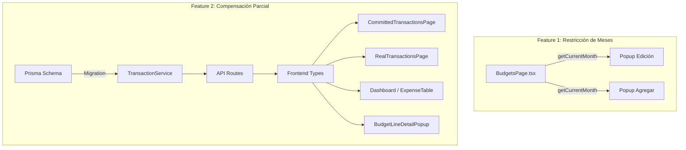

# Documento de Diseño: Restricción de Edición de Meses y Compensación Parcial

## Visión General

Este diseño cubre dos funcionalidades independientes que se implementan en la misma iteración:

1. **Restricción de meses**: Agregar lógica de detección del mes actual en `BudgetsPage.tsx` para deshabilitar inputs de meses pasados en ambos popups (edición y agregar línea).

2. **Compensación parcial**: Transformar el modelo de compensación 1:1 a N:1. Agregar campo `compensatedAmount` al schema, eliminar `@unique` de `compensatedById`, actualizar `TransactionService` para acumular/restar montos, y actualizar todas las vistas del frontend para mostrar saldo pendiente.

## Arquitectura



## Componentes e Interfaces

### Feature 1: Restricción de Meses

#### BudgetsPage.tsx - Lógica de mes actual

Se agrega una constante derivada del mes actual del sistema:

```typescript
const currentMonth = new Date().getMonth() + 1; // 1-12
const isMonthDisabled = (monthIndex: number) => monthIndex < currentMonth;
// monthIndex es 1-based (M1=1, M2=2, ..., M12=12)
```

#### Popup de Edición (Change Request)

En el mapeo de `MONTHS`, cada input recibe `disabled={isMonthDisabled(i + 1)}`:

```typescript
<input
  type="number"
  disabled={isMonthDisabled(i + 1)}
  className={`w-36 border rounded px-3 py-1.5 text-sm text-right ${
    isMonthDisabled(i + 1)
      ? 'bg-gray-100 text-gray-400 cursor-not-allowed'
      : 'focus:ring-2 focus:ring-accent focus:border-accent'
  }`}
/>
```

Al enviar la solicitud de cambio, los meses deshabilitados conservan sus valores originales porque el input está disabled y no se puede modificar.

#### Popup de Agregar Línea

Misma lógica: inputs de meses pasados deshabilitados con valor fijo en 0.

```typescript
<input
  type="number"
  disabled={isMonthDisabled(i + 1)}
  value={isMonthDisabled(i + 1) ? 0 : addMonthlyValues[i] || ''}
  className={`w-36 border rounded px-3 py-1.5 text-sm text-right ${
    isMonthDisabled(i + 1)
      ? 'bg-gray-100 text-gray-400 cursor-not-allowed'
      : 'focus:ring-2 focus:ring-accent focus:border-accent'
  }`}
/>
```

### Feature 2: Compensación Parcial

#### 1. Prisma Schema (schema.prisma)

Cambios en el modelo Transaction:

```prisma
model Transaction {
  // ... campos existentes ...
  compensatedById    String?          // ELIMINAR @unique
  compensatedAmount  Decimal          @default(0) @db.Decimal(15, 2)  // NUEVO
  // ELIMINAR relación inversa compensates Transaction?
  // ... resto igual ...
}
```

La eliminación de `@unique` en `compensatedById` permite que múltiples REAL referencien la misma COMMITTED. Se elimina la relación `compensates Transaction? @relation("Compensation")` ya que ahora es 1:N y se usa `compensatedBy` como la relación directa.

#### 2. TransactionService (TransactionService.ts)

**createTransaction**: Al crear una REAL con `committedTransactionId`:
- Validar que la comprometida existe y es tipo COMMITTED
- Validar que `compensatedAmount < transactionValue` (aún tiene saldo pendiente)
- Dentro de la transacción de BD: sumar `transactionValue` de la real al `compensatedAmount` de la comprometida
- Si `compensatedAmount + realValue >= transactionValue`, marcar `isCompensated = true`
- Si no, mantener `isCompensated = false`

```typescript
// Dentro de prisma.$transaction
if (data.type === TransactionType.REAL && data.committedTransactionId) {
  const committed = await tx.transaction.findUnique({
    where: { id: data.committedTransactionId }
  });
  const newCompensatedAmount = Number(committed.compensatedAmount) + data.transactionValue;
  const isFullyCompensated = newCompensatedAmount >= Number(committed.transactionValue);
  await tx.transaction.update({
    where: { id: data.committedTransactionId },
    data: {
      compensatedAmount: newCompensatedAmount,
      isCompensated: isFullyCompensated
    }
  });
}
```

**deleteTransaction**: Al eliminar una REAL que compensaba:
- Restar `transactionValue` de la real del `compensatedAmount` de la comprometida
- Garantizar `compensatedAmount >= 0` con `Math.max(0, ...)`
- Recalcular `isCompensated` basado en el nuevo `compensatedAmount`

```typescript
if (transaction.type === TransactionType.REAL && transaction.compensatedById) {
  const committed = await tx.transaction.findUnique({
    where: { id: transaction.compensatedById }
  });
  const newAmount = Math.max(0, Number(committed.compensatedAmount) - Number(transaction.transactionValue));
  await tx.transaction.update({
    where: { id: transaction.compensatedById },
    data: {
      compensatedAmount: newAmount,
      isCompensated: newAmount >= Number(committed.transactionValue)
    }
  });
}
```

**getUncompensatedCommitted**: Cambiar filtro de `isCompensated: false` a consulta donde `compensatedAmount < transactionValue`:

```typescript
async getUncompensatedCommitted(budgetLineId: string): Promise<Transaction[]> {
  return await this.prisma.$queryRaw`
    SELECT * FROM "Transaction"
    WHERE "budgetLineId" = ${budgetLineId}
    AND "type" = 'COMMITTED'
    AND "compensatedAmount" < "transactionValue"
    ORDER BY "postingDate" ASC
  `;
}
```

Alternativa con Prisma (sin raw query):
```typescript
return await this.prisma.transaction.findMany({
  where: {
    budgetLineId,
    type: TransactionType.COMMITTED,
    isCompensated: false  // mantener este filtro simple
  },
  orderBy: { postingDate: 'asc' },
  include: { budgetLine: { include: { expense: true } }, financialCompany: true }
});
```

Nota: dado que `isCompensated` se mantiene sincronizado con la lógica de compensación, el filtro `isCompensated: false` sigue siendo válido para encontrar comprometidas con saldo pendiente.

**getMonthlyCommitted**: Actualizar para usar saldo pendiente en lugar de filtrar solo no compensadas:

```typescript
async getMonthlyCommitted(budgetLineId: string, month: number) {
  const transactions = await this.prisma.transaction.findMany({
    where: { budgetLineId, month, type: TransactionType.COMMITTED }
  });
  // Sumar solo el saldo pendiente de cada comprometida
  const totalPending = transactions.reduce((sum, t) => {
    const pending = Number(t.transactionValue) - Number(t.compensatedAmount);
    return sum + Math.max(0, pending);
  }, 0);
  // ...
}
```

#### 3. Frontend Transaction Interface

Agregar `compensatedAmount` a la interfaz:

```typescript
interface Transaction {
  // ... campos existentes ...
  compensatedAmount: number;  // NUEVO
}
```

#### 4. CommittedTransactionsPage

Agregar columnas "Compensado" y "Pendiente" a la tabla. Badge triestado:
- Sin compensación (`compensatedAmount === 0`): Badge "No" amarillo
- Parcial (`0 < compensatedAmount < transactionValue`): Badge "Parcial" naranja
- Completa (`compensatedAmount >= transactionValue`): Badge "Sí" verde

#### 5. RealTransactionsPage - Picker de comprometidas

- Mostrar saldo pendiente (`transactionValue - compensatedAmount`) junto al valor original
- Pre-llenar campo de valor con el saldo pendiente
- Advertencia si el monto ingresado excede el saldo pendiente

#### 6. Dashboard / ExpenseTable

Cambiar cálculo de comprometido:
- Actual: filtra `!isCompensated` y suma `transactionValue` completo
- Nuevo: para cada comprometida, sumar `transactionValue - compensatedAmount` (saldo pendiente)

```typescript
// En ExpenseTable.tsx - cálculo de committed
const committedTotal = transactions
  .filter(t => t.month === month && t.type === 'COMMITTED')
  .reduce((sum, t) => sum + (Number(t.transactionValue) - Number(t.compensatedAmount)), 0);
```

#### 7. BudgetLineDetailPopup

- Agregar columnas Compensado y Pendiente en tabla de comprometidas
- Totales mensuales usan saldo pendiente

## Modelos de Datos

### Transaction (cambios)

| Campo | Tipo | Cambio |
|-------|------|--------|
| compensatedById | String? | Eliminar @unique |
| compensatedAmount | Decimal(15,2) | Nuevo, default 0 |
| compensates | Relation | Eliminar (ya no es 1:1) |

### Migración de datos existentes

```sql
-- Agregar campo compensatedAmount
ALTER TABLE "Transaction" ADD COLUMN "compensatedAmount" DECIMAL(15,2) DEFAULT 0;

-- Inicializar compensatedAmount para comprometidas ya compensadas
UPDATE "Transaction"
SET "compensatedAmount" = "transactionValue"
WHERE "isCompensated" = true AND type = 'COMMITTED';

-- Eliminar constraint unique de compensatedById
ALTER TABLE "Transaction" DROP CONSTRAINT IF EXISTS "Transaction_compensatedById_key";
```


## Propiedades de Correctitud

*Una propiedad es una característica o comportamiento que debe mantenerse verdadero en todas las ejecuciones válidas de un sistema — esencialmente, una declaración formal sobre lo que el sistema debe hacer. Las propiedades sirven como puente entre especificaciones legibles por humanos y garantías de correctitud verificables por máquina.*

### Property 1: Función de deshabilitación de meses

*Para cualquier* mes actual (1-12) y cualquier índice de mes (1-12), el mes debe estar deshabilitado si y solo si su índice es menor que el mes actual.

**Validates: Requirements 1.2, 2.2**

### Property 2: Preservación de valores en meses deshabilitados

*Para cualquier* conjunto de valores originales de una línea presupuestaria y cualquier mes actual, al enviar el formulario los valores de los meses con índice menor al mes actual deben ser iguales a los valores originales (en edición) o 0 (en creación).

**Validates: Requirements 1.4, 2.3, 2.4**

### Property 3: Invariante de isCompensated

*Para cualquier* Transacción_Comprometida, `isCompensated` es `true` si y solo si `compensatedAmount >= transactionValue`. En todos los demás casos, `isCompensated` es `false`.

**Validates: Requirements 3.3, 3.4, 4.2, 4.3, 5.2**

### Property 4: Acumulación de compensación (round-trip)

*Para cualquier* Transacción_Comprometida con saldo pendiente y cualquier Transacción_Real con valor positivo, crear la real debe incrementar `compensatedAmount` en exactamente el valor de la real, y eliminar esa misma real debe restaurar `compensatedAmount` al valor anterior.

**Validates: Requirements 4.1, 5.1**

### Property 5: compensatedAmount no negativo

*Para cualquier* secuencia de operaciones de creación y eliminación de transacciones reales sobre una comprometida, `compensatedAmount` debe ser siempre mayor o igual a 0.

**Validates: Requirements 5.3**

### Property 6: Rechazo de compensación sobre comprometida completa

*Para cualquier* Transacción_Comprometida con Compensación_Completa, intentar crear una nueva Transacción_Real que la referencie debe resultar en un error.

**Validates: Requirements 4.4**

### Property 7: Filtro de comprometidas con saldo pendiente

*Para cualquier* conjunto de transacciones comprometidas con distintos niveles de compensación, el endpoint de comprometidas no compensadas debe retornar exactamente aquellas donde `compensatedAmount < transactionValue`.

**Validates: Requirements 6.1**

### Property 8: Badge triestado de compensación

*Para cualquier* Transacción_Comprometida, el badge debe ser "No" (amarillo) si `compensatedAmount === 0`, "Parcial" (naranja) si `0 < compensatedAmount < transactionValue`, y "Sí" (verde) si `compensatedAmount >= transactionValue`.

**Validates: Requirements 7.3, 7.4, 7.5**

### Property 9: Cálculo de totales de comprometido usando saldo pendiente

*Para cualquier* conjunto de transacciones comprometidas en un mes, el total de comprometido debe ser igual a la suma de `(transactionValue - compensatedAmount)` de cada transacción, nunca la suma de `transactionValue` completo.

**Validates: Requirements 8.1, 8.2, 9.2**

### Property 10: Pre-llenado del picker con saldo pendiente

*Para cualquier* Transacción_Comprometida seleccionada en el picker, el campo de valor debe pre-llenarse con `transactionValue - compensatedAmount`.

**Validates: Requirements 10.2**

### Property 11: Advertencia por exceso de monto

*Para cualquier* Transacción_Comprometida y cualquier valor ingresado mayor que su Saldo_Pendiente, el sistema debe mostrar una advertencia.

**Validates: Requirements 10.3**

## Manejo de Errores

| Escenario | Comportamiento |
|-----------|---------------|
| Crear real referenciando comprometida completamente compensada | Rechazar con error "La transacción comprometida ya está completamente compensada" |
| Eliminar real que deja compensatedAmount < 0 | Usar `Math.max(0, ...)` para garantizar no negatividad |
| Comprometida referenciada no existe | Rechazar con error "Transacción comprometida no encontrada" |
| Comprometida referenciada no es tipo COMMITTED | Rechazar con error "La transacción referenciada no es comprometida" |

## Estrategia de Testing

### Testing Unitario

- Verificar que `isMonthDisabled` retorna correctamente para meses límite (mes actual, mes anterior, mes siguiente)
- Verificar badge triestado con valores específicos (0, parcial, completo)
- Verificar cálculo de saldo pendiente con valores decimales
- Verificar migración de datos existentes

### Testing de Propiedades (Property-Based Testing)

- Librería: `fast-check` (TypeScript)
- Mínimo 100 iteraciones por propiedad
- Cada test debe referenciar su propiedad del diseño con formato: **Feature: budget-restrictions-and-compensation, Property N: [título]**
- Cada propiedad de correctitud debe implementarse como un único test de propiedades

### Cobertura

- Tests unitarios: casos específicos, edge cases, condiciones de error
- Tests de propiedades: propiedades universales sobre todos los inputs válidos
- Ambos son complementarios y necesarios para cobertura completa
