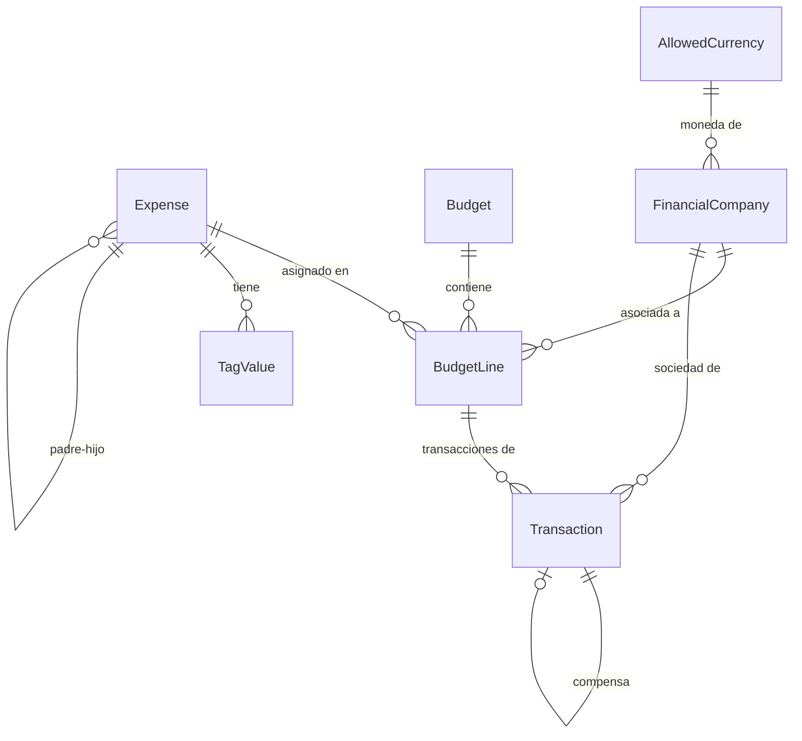

# Documento de Diseño: Refactorización de Lógica de Negocio

## Visión General

Esta refactorización transforma el modelo de datos de la aplicación de gestión de presupuestos tecnológicos para separar el gasto como entidad maestra independiente, reestructurar la tabla de presupuestos con clave compuesta (presupuesto + gasto + empresa financiera), implementar compensación entre transacciones comprometidas y reales, agregar sociedad financiera a transacciones, y crear un maestro de monedas permitidas. La UI de gastos se simplifica para mostrar solo datos maestros y tagging.

## Arquitectura

La refactorización afecta tres capas:

1. **Capa de Datos (Prisma/PostgreSQL)**: Cambios en el schema para separar Expense del Budget, crear BudgetLine, agregar AllowedCurrency, y modificar Transaction.
2. **Capa de Servicios (Node.js/Express)**: Refactorización de ExpenseService, BudgetService, TransactionService y creación de nuevos servicios.
3. **Capa de Presentación (React)**: Simplificación de ExpensesPage y ExpenseDetailPopup.



## Componentes e Interfaces

### Cambios en el Schema de Prisma

#### Modelo `Expense` (Refactorizado)
Se elimina `budgetId` y `financialCompanyId`. El gasto se convierte en entidad maestra pura.

```prisma
model Expense {
  id                    String        @id @default(uuid())
  code                  String        @unique  // Ahora único global
  shortDescription      String
  longDescription       String
  technologyDirections  String[]
  userAreas             String[]
  parentExpenseId       String?
  parentExpense         Expense?      @relation("ExpenseHierarchy", fields: [parentExpenseId], references: [id])
  childExpenses         Expense[]     @relation("ExpenseHierarchy")
  budgetLines           BudgetLine[]
  tagValues             TagValue[]
  active                Boolean       @default(true)
  createdAt             DateTime      @default(now())
  updatedAt             DateTime      @updatedAt
}
```

#### Modelo `BudgetLine` (Nuevo)
Reemplaza la relación directa Expense-Budget. Contiene la clave compuesta y los valores planificados mensuales.

```prisma
model BudgetLine {
  id                  String           @id @default(uuid())
  budgetId            String
  budget              Budget           @relation(fields: [budgetId], references: [id], onDelete: Cascade)
  expenseId           String
  expense             Expense          @relation(fields: [expenseId], references: [id], onDelete: Cascade)
  financialCompanyId  String
  financialCompany    FinancialCompany @relation(fields: [financialCompanyId], references: [id])
  currency            String
  planM1              Decimal          @default(0) @db.Decimal(15, 2)
  planM2              Decimal          @default(0) @db.Decimal(15, 2)
  planM3              Decimal          @default(0) @db.Decimal(15, 2)
  planM4              Decimal          @default(0) @db.Decimal(15, 2)
  planM5              Decimal          @default(0) @db.Decimal(15, 2)
  planM6              Decimal          @default(0) @db.Decimal(15, 2)
  planM7              Decimal          @default(0) @db.Decimal(15, 2)
  planM8              Decimal          @default(0) @db.Decimal(15, 2)
  planM9              Decimal          @default(0) @db.Decimal(15, 2)
  planM10             Decimal          @default(0) @db.Decimal(15, 2)
  planM11             Decimal          @default(0) @db.Decimal(15, 2)
  planM12             Decimal          @default(0) @db.Decimal(15, 2)
  transactions        Transaction[]
  savings             Saving[]
  deferrals           Deferral[]
  createdAt           DateTime         @default(now())
  updatedAt           DateTime         @updatedAt

  @@unique([budgetId, expenseId, financialCompanyId])
  @@index([budgetId])
  @@index([expenseId])
  @@index([financialCompanyId])
}
```

#### Modelo `AllowedCurrency` (Nuevo)

```prisma
model AllowedCurrency {
  id        String             @id @default(uuid())
  code      String             @unique  // ISO 4217
  name      String
  companies FinancialCompany[]
  createdAt DateTime           @default(now())
  updatedAt DateTime           @updatedAt
}
```

#### Modelo `FinancialCompany` (Modificado)
Se agrega relación con moneda permitida.

```prisma
model FinancialCompany {
  id              String           @id @default(uuid())
  code            String           @unique
  name            String
  description     String?
  taxId           String?
  currencyCode    String
  allowedCurrency AllowedCurrency  @relation(fields: [currencyCode], references: [code])
  budgetLines     BudgetLine[]
  transactions    Transaction[]
  createdAt       DateTime         @default(now())
  updatedAt       DateTime         @updatedAt
}
```

#### Modelo `Transaction` (Modificado)
Se agrega financialCompanyId, campo de referencia a comprometida, y marca de compensación.

```prisma
model Transaction {
  id                        String            @id @default(uuid())
  budgetLineId              String
  budgetLine                BudgetLine        @relation(fields: [budgetLineId], references: [id], onDelete: Cascade)
  financialCompanyId        String
  financialCompany          FinancialCompany  @relation(fields: [financialCompanyId], references: [id])
  type                      TransactionType
  serviceDate               DateTime
  postingDate               DateTime
  referenceDocumentNumber   String
  externalPlatformLink      String
  transactionCurrency       String
  transactionValue          Decimal           @db.Decimal(15, 2)
  usdValue                  Decimal           @db.Decimal(15, 2)
  conversionRate            Decimal           @db.Decimal(10, 6)
  month                     Int
  compensatedById           String?           @unique
  compensatedBy             Transaction?      @relation("Compensation", fields: [compensatedById], references: [id])
  compensates               Transaction?      @relation("Compensation")
  isCompensated             Boolean           @default(false)
  createdAt                 DateTime          @default(now())
  updatedAt                 DateTime          @updatedAt

  @@unique([budgetLineId, referenceDocumentNumber])
  @@index([budgetLineId, month])
  @@index([type])
  @@index([financialCompanyId])
  @@index([isCompensated])
}
```

#### Modelo `Budget` (Modificado)

```prisma
model Budget {
  id              String            @id @default(uuid())
  year            Int
  version         String
  budgetLines     BudgetLine[]
  conversionRates ConversionRate[]
  createdAt       DateTime          @default(now())
  updatedAt       DateTime          @updatedAt

  @@unique([year, version])
  @@index([year])
}
```

### Interfaces de Servicio

#### ExpenseService (Refactorizado)
```typescript
class ExpenseService {
  createExpense(data: ExpenseMasterInput): Promise<Expense>
  getExpense(id: string): Promise<ExpenseMaster>  // Solo datos maestros + tags
  getAllExpenses(filters?: ExpenseFilters): Promise<ExpenseMaster[]>
  updateExpense(id: string, data: Partial<ExpenseMasterInput>): Promise<Expense>
  deleteExpense(id: string): Promise<void>
}
```

#### BudgetLineService (Nuevo)
```typescript
class BudgetLineService {
  createBudgetLine(data: BudgetLineInput): Promise<BudgetLine>
  getBudgetLinesByBudget(budgetId: string): Promise<BudgetLine[]>
  updatePlanValues(id: string, values: MonthlyPlanValues): Promise<BudgetLine>
  deleteBudgetLine(id: string): Promise<void>
}
```

#### TransactionService (Refactorizado)
```typescript
class TransactionService {
  createTransaction(data: TransactionInput): Promise<Transaction>
  // Al crear REAL con committedTransactionId, marca la comprometida como compensada
  getUncompensatedCommitted(budgetLineId: string): Promise<Transaction[]>
  getMonthlyAggregation(budgetLineId: string, type: TransactionType): CommittedAggregation
  deleteTransaction(id: string): Promise<void>
  // Al eliminar REAL que compensaba, revierte la marca
}
```

## Modelos de Datos

### Tipos TypeScript del Frontend

```typescript
interface ExpenseMaster {
  id: string;
  code: string;
  shortDescription: string;
  longDescription: string;
  technologyDirections: string[];
  userAreas: string[];
  parentExpenseId?: string;
  active: boolean;
  customTags: CustomTag[];
}

interface BudgetLine {
  id: string;
  budgetId: string;
  expenseId: string;
  financialCompanyId: string;
  currency: string;
  planM1: number; planM2: number; planM3: number; planM4: number;
  planM5: number; planM6: number; planM7: number; planM8: number;
  planM9: number; planM10: number; planM11: number; planM12: number;
  expense?: ExpenseMaster;
  financialCompany?: FinancialCompany;
}

interface Transaction {
  id: string;
  budgetLineId: string;
  financialCompanyId: string;
  type: 'COMMITTED' | 'REAL';
  serviceDate: string;
  postingDate: string;
  referenceDocumentNumber: string;
  externalPlatformLink: string;
  transactionCurrency: string;
  transactionValue: number;
  usdValue: number;
  conversionRate: number;
  month: number;
  compensatedById?: string;
  isCompensated: boolean;
}

interface AllowedCurrency {
  id: string;
  code: string;
  name: string;
}

interface FinancialCompany {
  id: string;
  code: string;
  name: string;
  description?: string;
  taxId?: string;
  currencyCode: string;
}
```

### Migración de Datos

La migración debe ejecutarse en este orden:
1. Crear tabla `AllowedCurrency` y poblar con monedas existentes (USD, EUR, CLP)
2. Agregar `currencyCode` a `FinancialCompany` y poblar desde datos existentes
3. Crear tabla `BudgetLine` 
4. Migrar datos de `Expense` + `PlanValue` a `BudgetLine` (un registro por combinación expense-budget-company)
5. Agregar `financialCompanyId`, `compensatedById`, `isCompensated` a `Transaction`
6. Cambiar `expenseId` por `budgetLineId` en `Transaction`
7. Eliminar `budgetId` y `financialCompanyId` de `Expense`
8. Eliminar tabla `PlanValue` (datos migrados a BudgetLine)
9. Cambiar constraint de `code` en `Expense` de `@@unique([budgetId, code])` a `@unique`

## Propiedades de Correctitud

*Una propiedad es una característica o comportamiento que debe mantenerse verdadero en todas las ejecuciones válidas de un sistema — esencialmente, una declaración formal sobre lo que el sistema debe hacer. Las propiedades sirven como puente entre especificaciones legibles por humanos y garantías de correctitud verificables por máquina.*

### Propiedad 1: Independencia del gasto
*Para cualquier* dato válido de gasto maestro, la creación de un gasto debe tener éxito sin requerir un ID de presupuesto ni un ID de empresa financiera, y el gasto creado debe contener todos los campos maestros proporcionados.
**Valida: Requisitos 1.1**

### Propiedad 2: Unicidad global de código de gasto
*Para cualquier* par de gastos con el mismo código, la creación del segundo gasto debe ser rechazada por el sistema, independientemente de cualquier otro campo.
**Valida: Requisitos 1.2**

### Propiedad 3: Consulta de gasto retorna solo datos maestros
*Para cualquier* gasto existente con tags, transacciones y líneas de presupuesto asociadas, la consulta del gasto debe retornar únicamente datos maestros y tags, sin información de transacciones ni presupuestos.
**Valida: Requisitos 1.3**

### Propiedad 4: Unicidad de clave compuesta de línea de presupuesto
*Para cualquier* combinación de presupuesto, gasto y empresa financiera, solo puede existir una línea de presupuesto. La creación de una segunda línea con la misma combinación debe ser rechazada.
**Valida: Requisitos 2.1**

### Propiedad 5: Estructura de línea de presupuesto con 12 meses inicializados en cero
*Para cualquier* línea de presupuesto recién creada, los 12 campos de valores planificados mensuales (planM1 a planM12) deben ser iguales a cero, y el campo de moneda debe coincidir con la moneda de la empresa financiera asociada.
**Valida: Requisitos 2.2, 2.4, 2.3, 3.4**

### Propiedad 6: Validación de moneda de empresa financiera contra maestro
*Para cualquier* empresa financiera, su moneda asociada (currencyCode) debe existir en el maestro de monedas permitidas. La asignación de una moneda inexistente debe ser rechazada.
**Valida: Requisitos 3.2, 3.3**

### Propiedad 7: Filtrado de transacciones comprometidas no compensadas y suma mensual
*Para cualquier* conjunto de transacciones comprometidas asociadas a una línea de presupuesto, la suma mensual para el dashboard debe incluir solo las transacciones no compensadas (isCompensated = false), agrupadas por el mes derivado de la fecha de imputación (postingDate). La suma debe ser igual a la suma aritmética de los valores de las transacciones no compensadas de ese mes.
**Valida: Requisitos 4.1, 4.3, 5.3**

### Propiedad 8: Detección de mes por fecha de imputación
*Para cualquier* transacción (comprometida o real), el mes asignado debe ser igual al mes extraído de la fecha de imputación (postingDate). Es decir, para una postingDate en marzo, el mes debe ser 3.
**Valida: Requisitos 4.2, 5.4**

### Propiedad 9: Compensación al crear transacción real
*Para cualquier* transacción real que referencia a una transacción comprometida existente, después de la creación, la transacción comprometida debe tener isCompensated = true.
**Valida: Requisitos 5.2**

### Propiedad 10: Reversión de compensación (ida y vuelta)
*Para cualquier* transacción real que compensó a una comprometida, al eliminar la transacción real, la transacción comprometida debe volver a tener isCompensated = false. Es decir, crear y luego eliminar una transacción real que compensa debe dejar la comprometida en su estado original.
**Valida: Requisitos 5.5**

### Propiedad 11: Independencia de moneda de transacción respecto a empresa financiera
*Para cualquier* transacción con una moneda de transacción diferente a la moneda de su empresa financiera, el sistema debe almacenar ambos valores correctamente sin modificar la moneda de transacción.
**Valida: Requisitos 6.2**

### Propiedad 12: Precisión decimal de montos
*Para cualquier* monto de transacción, el valor almacenado debe tener exactamente dos decimales de precisión. Es decir, para un valor de entrada X, el valor almacenado debe ser igual a round(X, 2).
**Valida: Requisitos 6.3**

### Propiedad 13: Validación de empresa financiera en transacciones
*Para cualquier* transacción con un financialCompanyId inexistente, la creación debe ser rechazada por el sistema.
**Valida: Requisitos 6.4**

## Manejo de Errores

| Escenario | Código HTTP | Mensaje |
|---|---|---|
| Código de gasto duplicado global | 409 | "Ya existe un gasto con el código {code}" |
| Línea de presupuesto duplicada (misma clave compuesta) | 409 | "Ya existe una línea para este gasto y empresa en este presupuesto" |
| Moneda no permitida para empresa financiera | 400 | "La moneda {code} no está en el maestro de monedas permitidas" |
| Empresa financiera no encontrada en transacción | 404 | "Empresa financiera no encontrada" |
| Transacción comprometida ya compensada | 400 | "La transacción comprometida ya está compensada" |
| Transacción comprometida referenciada no encontrada | 404 | "Transacción comprometida referenciada no encontrada" |

## Estrategia de Testing

### Tests Unitarios
- Validación de campos requeridos en creación de gastos maestros
- Validación de clave compuesta en BudgetLine
- Derivación de moneda desde empresa financiera
- Lógica de compensación (marcar/desmarcar)
- Cálculo de mes desde postingDate
- Formato de montos con 2 decimales

### Tests de Propiedades (Property-Based Testing)
- Librería: **fast-check** (para TypeScript/Node.js)
- Mínimo 100 iteraciones por propiedad
- Cada test debe referenciar la propiedad del diseño con el formato:
  **Feature: business-logic-refactor, Property {N}: {título}**

### Tests de Integración
- Flujo completo: crear gasto → crear línea de presupuesto → crear transacción comprometida → crear transacción real con compensación → verificar dashboard
- Migración de datos: verificar que los datos existentes se migran correctamente al nuevo schema
