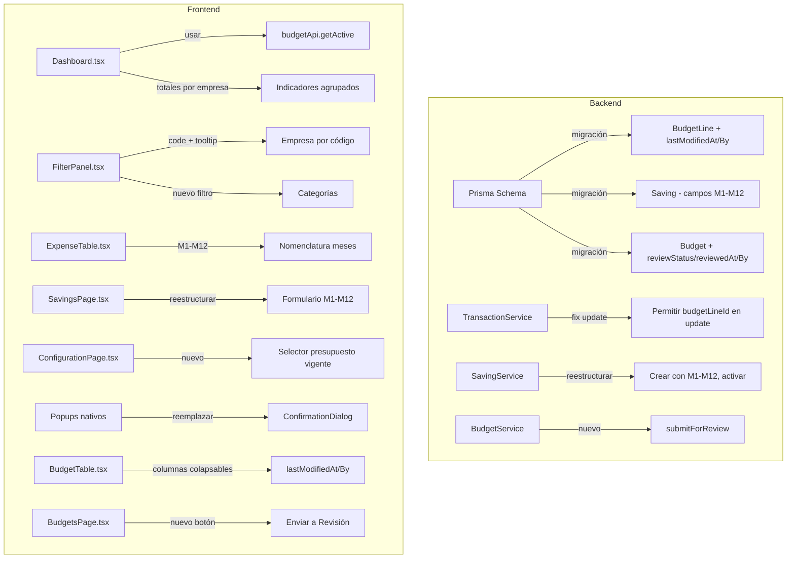

# Documento de Diseño: Dashboard y Reestructuración de Ahorros

## Visión General

Este diseño cubre un conjunto amplio de mejoras incrementales al sistema de gestión presupuestaria. Los cambios abarcan: mejoras de UX en el Dashboard (filtros, nomenclatura de meses, totales por compañía), corrección de bugs, reestructuración del módulo de ahorros, trazabilidad de modificaciones, configuración de presupuesto vigente, workflow de revisión, y estandarización de diálogos de confirmación.

La arquitectura existente (backend Node.js + Prisma/PostgreSQL, frontend React/TypeScript/Tailwind) se mantiene. Todos los cambios son incrementales.

## Arquitectura



## Componentes e Interfaces

### Backend

#### 1. Prisma Schema - Cambios al modelo `BudgetLine`
- Agregar `lastModifiedAt DateTime?`
- Agregar `lastModifiedById String?`
- Agregar relación `lastModifiedBy User?`

#### 2. Prisma Schema - Cambios al modelo `Saving`
- Reemplazar `totalAmount` por campo calculado (se mantiene para compatibilidad pero se calcula de M1-M12)
- Agregar campos `savingM1` a `savingM12` (Decimal, default 0)
- Cambiar `SavingStatus`: `PENDING` → `ACTIVE` (renombrar `APPROVED` a `ACTIVE`)

#### 3. Prisma Schema - Cambios al modelo `Budget`
- Agregar `reviewStatus String? @default(null)` (valores: null, "IN_REVIEW", "REVIEWED")
- Agregar `reviewSubmittedAt DateTime?`
- Agregar `reviewSubmittedById String?`
- Agregar relación `reviewSubmittedBy User?`

#### 4. TransactionService - Fix de actualización
- En `updateTransaction()`, permitir actualizar `budgetLineId` cuando se proporciona
- Actualmente el código hace `delete updateData.budgetLineId` lo que impide la actualización
- Cambiar para que si `data.budgetLineId` se proporciona, se incluya en el update

#### 5. SavingService - Reestructuración
- Cambiar `SavingInput` para aceptar `savingM1` a `savingM12` en lugar de `distributionStrategy`
- `totalAmount` se calcula como suma de `savingM1` a `savingM12`
- Nuevo método `activateSaving(id)` que cambia estado a `ACTIVE`
- Eliminar lógica de `calculateMonthlyDistribution`
- Actualizar `getSavings` para incluir campos mensuales

#### 6. BudgetService - Enviar a revisión
- Nuevo método `submitForReview(budgetId, userId)` que actualiza `reviewStatus`, `reviewSubmittedAt`, `reviewSubmittedById`
- Nueva ruta `POST /budgets/:id/submit-review`

#### 7. BudgetLineService - Trazabilidad
- Actualizar operaciones de modificación de BudgetLine para registrar `lastModifiedAt` y `lastModifiedById`
- Incluir `lastModifiedBy` en los includes de queries relevantes

### Frontend

#### 8. FilterPanel.tsx
- Cambiar `company.name` → `company.code` en botones de empresa financiera
- Agregar atributo `title={company.name}` para tooltip
- Agregar sección de filtro por categoría (extraer categorías únicas de `budgetLines[].expense?.category`)
- Agregar prop `categories` y `onCategoryToggle` al estado de filtros

#### 9. ExpenseTable.tsx - Nomenclatura de meses
- Cambiar array `months` de `['Ene', 'Feb', ...]` a `['M1', 'M2', ..., 'M12']`

#### 10. Dashboard.tsx
- Usar `budgetApi.getActive()` en lugar de `budgetApi.getAll()` + buscar activo
- Agregar estado de filtro `categories`
- Calcular totales agrupados por `financialCompanyId`
- Mostrar indicadores por empresa financiera (código como etiqueta)
- Integrar ahorros activos: mostrar valor consolidado (original - ahorro)
- Colorear celdas afectadas por ahorro

#### 11. SavingsPage.tsx - Reestructuración
- Reemplazar formulario de distribución por 12 inputs (M1-M12)
- Calcular total automáticamente
- Agregar popup de detalle al hacer click en un ahorro
- Agregar botón "Activar" en ahorros pendientes
- Usar `ConfirmationDialog` en lugar de `confirm()` nativo

#### 12. ConfigurationPage.tsx
- Agregar sección "Presupuesto Vigente" con selector de presupuestos
- Mostrar presupuesto vigente actual con indicador visual
- Botón para cambiar presupuesto vigente con confirmación

#### 13. BudgetsPage.tsx
- Agregar botón "Enviar a Revisión"
- Mostrar estado de revisión del presupuesto
- Integrar popup de detalle de solicitudes de cambio (click en "Mis Solicitudes")

#### 14. BudgetTable.tsx - Columnas colapsables
- Agregar columnas "Última Modificación" y "Modificado por" al final
- Estado colapsable con botón toggle
- Mostrar fecha formateada y nombre del usuario

#### 15. ExpenseDetailPopup.tsx / Dashboard popup
- Mostrar info de última modificación de la línea
- Mostrar desglose de ahorro si aplica (original, ahorro, consolidado)

#### 16. Reemplazo de popups nativos
- `RealTransactionsPage.tsx`: reemplazar `confirm()` en `handleDelete` por `ConfirmationDialog`
- `SavingsPage.tsx`: reemplazar `confirm()` en `handleDeleteSaving` por `ConfirmationDialog`
- `ExpenseDetailPopup.tsx`: reemplazar `confirm()` en `handleDeleteTag` por `ConfirmationDialog`
- Buscar y reemplazar cualquier otro uso de `confirm()` o `alert()` nativo

## Modelos de Datos

### Cambios al modelo BudgetLine

```prisma
model BudgetLine {
  // campos existentes...
  lastModifiedAt    DateTime?
  lastModifiedById  String?
  lastModifiedBy    User?     @relation("BudgetLineModifier", fields: [lastModifiedById], references: [id])
}
```

### Cambios al modelo Saving

```prisma
model Saving {
  // campos existentes (se mantiene totalAmount, monthlyDistribution se depreca)
  savingM1   Decimal @default(0) @db.Decimal(15, 2)
  savingM2   Decimal @default(0) @db.Decimal(15, 2)
  // ... hasta savingM12
  savingM12  Decimal @default(0) @db.Decimal(15, 2)
}

enum SavingStatus {
  PENDING
  ACTIVE
}
```

### Cambios al modelo Budget

```prisma
model Budget {
  // campos existentes...
  reviewStatus        String?
  reviewSubmittedAt   DateTime?
  reviewSubmittedById String?
  reviewSubmittedBy   User?     @relation("BudgetReviewer", fields: [reviewSubmittedById], references: [id])
}
```

### Interfaz de filtros actualizada (Frontend)

```typescript
interface DashboardFilters {
  currencies?: string[];
  financialCompanyIds?: string[];
  categories?: string[];
  searchText: string;
  visibleColumns: { budget: boolean; committed: boolean; real: boolean };
}
```

### Interfaz de Saving actualizada (Frontend)

```typescript
interface Saving {
  id: string;
  budgetLineId: string;
  totalAmount: number;
  description: string;
  status: 'PENDING' | 'ACTIVE';
  savingM1: number;
  savingM2: number;
  // ... hasta savingM12
  savingM12: number;
  monthlyDistribution: Record<number, number>; // deprecado, mantener por compat
  createdBy: string;
  createdAt: string;
  budgetLine?: BudgetLine;
  user?: { id: string; username: string; fullName: string };
}
```

### Totales por empresa financiera (Dashboard)

```typescript
interface CompanyTotals {
  companyId: string;
  companyCode: string;
  budget: number;
  committed: number;
  real: number;
  diff: number;
}
```

## Propiedades de Correctitud

*Una propiedad es una característica o comportamiento que debe mantenerse verdadero en todas las ejecuciones válidas de un sistema — esencialmente, una declaración formal sobre lo que el sistema debe hacer. Las propiedades sirven como puente entre especificaciones legibles por humanos y garantías de correctitud verificables por máquina.*

### Propiedad 1: Correctitud de filtros en el Dashboard

*Para cualquier* conjunto de líneas presupuestarias y cualquier combinación de filtros (empresas financieras, categorías, monedas, texto de búsqueda), el resultado filtrado debe contener únicamente líneas que cumplan todos los criterios de filtro seleccionados. Además, al limpiar todos los filtros, el resultado debe ser idéntico al conjunto original.

**Valida: Requisitos 1.3, 8.2, 8.3**

### Propiedad 2: Actualización de transacción con budgetLineId (round-trip)

*Para cualquier* transacción real existente y cualquier `budgetLineId` válido, actualizar la transacción con ese `budgetLineId` y luego consultarla debe devolver el `budgetLineId` asignado.

**Valida: Requisito 3.1**

### Propiedad 3: Exactamente un presupuesto vigente (invariante)

*Para cualquier* operación de `setActiveBudget`, después de ejecutarla debe existir exactamente un presupuesto con `isActive = true` en la base de datos, y ese presupuesto debe ser el que se seleccionó.

**Valida: Requisito 5.2**

### Propiedad 4: Envío a revisión registra metadatos

*Para cualquier* presupuesto enviado a revisión, el registro debe contener un `reviewStatus` no nulo, un `reviewSubmittedAt` con timestamp válido, y un `reviewSubmittedById` que corresponda al usuario que realizó el envío.

**Valida: Requisito 6.2**

### Propiedad 5: Trazabilidad de modificaciones en líneas presupuestarias

*Para cualquier* modificación a una línea presupuestaria, después de la operación los campos `lastModifiedAt` y `lastModifiedById` deben estar actualizados con la fecha/hora actual y el ID del usuario que realizó el cambio.

**Valida: Requisito 7.1**

### Propiedad 6: Total de ahorro es suma de valores mensuales

*Para cualquier* ahorro con valores mensuales `savingM1` a `savingM12`, el campo `totalAmount` debe ser igual a la suma de los 12 valores mensuales.

**Valida: Requisito 11.3**

### Propiedad 7: Activar ahorro no modifica valores originales (invariante)

*Para cualquier* línea presupuestaria, al activar un ahorro asociado, los valores originales `planM1` a `planM12` de la línea deben permanecer sin cambios.

**Valida: Requisito 11.6**

### Propiedad 8: Valor consolidado en Dashboard (original - ahorro)

*Para cualquier* línea presupuestaria con ahorros activos, el valor consolidado mostrado para cada mes debe ser igual a `planMx - sum(savingMx de ahorros activos)`.

**Valida: Requisito 11.7**

### Propiedad 9: Totales por empresa financiera

*Para cualquier* conjunto de líneas presupuestarias (filtradas o no), los totales agrupados por empresa financiera deben ser iguales a la suma de los valores individuales de cada línea perteneciente a esa empresa.

**Valida: Requisitos 9.1, 9.2**

## Manejo de Errores

| Escenario | Comportamiento |
|---|---|
| No existe presupuesto vigente | Dashboard muestra mensaje informativo, no error |
| `budgetLineId` inválido en update de transacción | Backend retorna 404 con mensaje descriptivo |
| Ahorro con valores mensuales negativos | Backend rechaza con error 400 |
| Intentar activar ahorro ya activo | Backend retorna error 409 |
| Intentar enviar a revisión presupuesto ya en revisión | Backend retorna error 409 |
| `lastModifiedById` referencia usuario inexistente | No debería ocurrir (viene del token de sesión) |
| Filtros con IDs inválidos | Se ignoran silenciosamente |

## Estrategia de Testing

### Tests Unitarios
- Lógica de filtrado en el frontend (función de filtro pura con categorías, empresas, monedas)
- Cálculo de totales por empresa financiera
- Cálculo de valor consolidado (original - ahorro)
- Cálculo de total de ahorro como suma de M1-M12
- Validación de formulario de ahorro (valores no negativos)
- Verificación de que `updateTransaction` permite `budgetLineId`

### Tests de Propiedades (Property-Based Testing)
- Librería: `fast-check` (ecosistema TypeScript)
- Mínimo 100 iteraciones por propiedad
- Cada test referencia su propiedad del documento de diseño
- Formato de tag: **Feature: dashboard-and-savings-overhaul, Property {N}: {título}**

### Cobertura
- Propiedad 1: lógica de filtrado frontend (función pura)
- Propiedad 2: servicio de transacciones backend
- Propiedad 3: servicio de presupuestos backend
- Propiedad 4: servicio de presupuestos backend
- Propiedad 5: servicio de budget lines backend
- Propiedad 6: servicio de ahorros backend/frontend
- Propiedad 7: servicio de ahorros backend (invariante)
- Propiedad 8: lógica de consolidación frontend
- Propiedad 9: lógica de agrupación frontend
