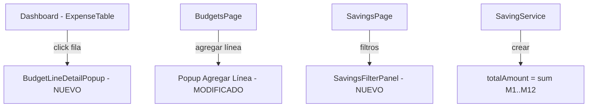

# Documento de Diseño: Dashboard Popup y Correcciones de Ahorros

## Visión General

Este diseño cubre cuatro mejoras en la aplicación de gestión presupuestaria:

1. Un nuevo popup de detalle en el dashboard que muestra información completa de la línea presupuestaria con meses en vertical, incluyendo presupuesto, comprometido, real y diferencia.
2. Rediseño del formulario de agregar línea presupuestaria para mostrar meses en vertical (consistente con el popup de edición).
3. Eliminación del campo `totalAmount` editable en ahorros, reemplazándolo por un cálculo automático basado en la suma de valores mensuales.
4. Adición de filtros (moneda, categoría, sociedad, área de tecnología) en la sección de ahorros.

## Arquitectura

La arquitectura existente se mantiene: React + TypeScript en el frontend, Node.js + Express + Prisma en el backend. Los cambios son principalmente en el frontend con un ajuste menor en el backend para el cálculo de ahorros.



## Componentes e Interfaces

### 1. BudgetLineDetailPopup (Nuevo componente)

Reemplaza el comportamiento actual del dashboard donde al hacer clic se abre `ExpenseDetailPopup`. El nuevo popup muestra datos presupuestarios completos con meses en vertical.

```typescript
// frontend/src/components/BudgetLineDetailPopup.tsx
interface BudgetLineDetailPopupProps {
  budgetLine: BudgetLine;
  activeSavings: Saving[];
  onClose: () => void;
}
```

El popup recibe directamente la `BudgetLine` (que ya contiene `expense`, `financialCompany`, `transactions`) y los ahorros activos. Calcula internamente los valores mensuales de presupuesto, comprometido, real y diferencia.

Estructura visual:
- Encabezado: código y descripción del gasto
- Metadatos: moneda, sociedad financiera, categoría del gasto
- Tabla vertical de meses (M1-M12 como filas) con columnas: Presupuesto, Comprometido, Real, Diferencia
- Fila de totales al final

### 2. Modificación del Popup Agregar Línea (BudgetsPage)

El formulario actual muestra los meses en una grilla de 6 columnas (`grid-cols-6`). Se cambiará a formato vertical idéntico al popup de edición existente (`editPopupLine`), que usa un diseño de lista con una fila por mes mostrando etiqueta y campo de entrada.

### 3. SavingsFilterPanel (Nuevo componente o integración)

Se reutilizará la lógica del `FilterPanel` existente adaptada para la sección de ahorros. Los filtros se aplicarán en el frontend sobre la lista de ahorros ya cargada, filtrando por las propiedades de la `budgetLine` asociada a cada ahorro.

```typescript
interface SavingsFilters {
  currencies: string[];
  financialCompanyIds: string[];
  categories: string[];
  technologyDirectionIds: string[];
}
```

### 4. Cálculo automático de totalAmount en Ahorros

El backend ya calcula `totalAmount` como suma de valores mensuales en `SavingService.createSaving()`. El cambio principal es en el frontend:
- Eliminar cualquier campo editable de monto total en el formulario de creación
- Mostrar el total como valor calculado (solo lectura)
- En el detalle, calcular el total desde los valores mensuales en lugar de usar `totalAmount`

## Modelos de Datos

No se requieren cambios en el esquema de base de datos. Los modelos existentes son suficientes:

- `BudgetLine`: contiene `planM1..planM12`, relaciones con `expense`, `financialCompany`, `transactions`, `savings`
- `Saving`: contiene `savingM1..savingM12`, `totalAmount`, relación con `budgetLine`
- `Transaction`: contiene `type` (COMMITTED/REAL), `transactionValue`, `month`

El campo `totalAmount` en `Saving` se mantiene en la base de datos por compatibilidad, pero siempre se calcula como suma de valores mensuales.

## Propiedades de Correctitud

*Una propiedad es una característica o comportamiento que debe mantenerse verdadero en todas las ejecuciones válidas de un sistema — esencialmente, una declaración formal sobre lo que el sistema debe hacer. Las propiedades sirven como puente entre especificaciones legibles por humanos y garantías de correctitud verificables por máquina.*

### Propiedad 1: Metadatos completos en el popup del dashboard
*Para cualquier* línea presupuestaria con moneda, sociedad financiera y categoría de gasto definidas, el popup de detalle del dashboard debe incluir los tres metadatos en su renderizado.
**Valida: Requisitos 1.1**

### Propiedad 2: Estructura mensual vertical con 12 filas
*Para cualquier* línea presupuestaria, el popup de detalle del dashboard debe renderizar exactamente 12 filas de meses (M1 a M12), cada una con valores de presupuesto, comprometido, real y diferencia.
**Valida: Requisitos 1.2, 1.3**

### Propiedad 3: Diferencia mensual correcta
*Para cualquier* mes y cualquier línea presupuestaria, la diferencia mostrada debe ser igual a presupuesto - comprometido - real para ese mes.
**Valida: Requisitos 1.3**

### Propiedad 4: Totales como suma de valores mensuales
*Para cualquier* conjunto de 12 valores mensuales (presupuesto, comprometido, real), la fila de totales debe mostrar la suma exacta de cada columna, y la diferencia total debe ser igual a total_presupuesto - total_comprometido - total_real.
**Valida: Requisitos 1.4, 2.2**

### Propiedad 5: Presupuesto neto con ahorros
*Para cualquier* línea presupuestaria con ahorros activos, el presupuesto mostrado por mes debe ser igual al valor planificado original menos la suma de ahorros activos para ese mes.
**Valida: Requisitos 1.5**

### Propiedad 6: Invariante del monto total de ahorro
*Para cualquier* ahorro válido, el monto total (totalAmount) debe ser exactamente igual a la suma de savingM1 + savingM2 + ... + savingM12.
**Valida: Requisitos 3.1, 3.3, 3.4**

### Propiedad 7: Filtros individuales en ahorros retornan solo elementos coincidentes
*Para cualquier* lista de ahorros y cualquier filtro individual (moneda, categoría, sociedad o área de tecnología), todos los ahorros mostrados después de aplicar el filtro deben tener la propiedad filtrada coincidente en su línea presupuestaria asociada.
**Valida: Requisitos 4.2, 4.3, 4.4, 4.5**

### Propiedad 8: Filtros combinados como intersección
*Para cualquier* lista de ahorros y cualquier combinación de filtros activos, el resultado debe ser igual a la intersección de aplicar cada filtro individualmente.
**Valida: Requisitos 4.6**

## Manejo de Errores

- Si la línea presupuestaria no tiene transacciones, el popup muestra 0 en comprometido y real.
- Si no hay ahorros activos, el presupuesto se muestra sin descuentos.
- Si los datos de la línea presupuestaria no incluyen relaciones (expense, financialCompany), se muestra "-" en los campos correspondientes.
- Los filtros de ahorros manejan el caso de listas vacías mostrando un mensaje informativo.

## Estrategia de Testing

### Tests Unitarios
- Verificar que `BudgetLineDetailPopup` renderiza los metadatos correctos para un caso específico.
- Verificar que el formulario de agregar línea muestra 12 filas verticales.
- Verificar que el formulario de ahorros no muestra campo editable de monto total.
- Verificar que los filtros de ahorros muestran las opciones correctas.

### Tests de Propiedades (Property-Based Testing)
- Librería: `fast-check` (ya disponible o se agrega como dependencia de desarrollo)
- Mínimo 100 iteraciones por test de propiedad
- Cada test referencia su propiedad del documento de diseño

Formato de etiqueta: **Feature: dashboard-popup-and-savings-fixes, Property {N}: {título}**

Los tests de propiedades se enfocan en las funciones de cálculo puras:
- Función de cálculo de valores mensuales (presupuesto neto, diferencia)
- Función de cálculo de totales
- Invariante de totalAmount en ahorros
- Función de filtrado de ahorros
