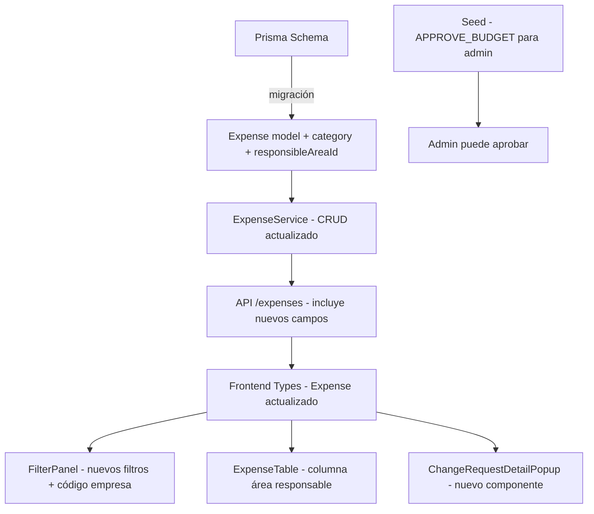

# Documento de Diseño: Categoría de Gastos y Filtros

## Visión General

Este diseño abarca las modificaciones necesarias para agregar campos de categoría y área responsable al modelo de gastos, nuevos filtros en el Dashboard, un popup de detalle de solicitudes de cambio, y la corrección del permiso de aprobación para administradores. Los cambios afectan el esquema de Prisma, los servicios del backend, los tipos del frontend, y varios componentes de React.

## Arquitectura

La arquitectura existente se mantiene: backend Node.js con Prisma/PostgreSQL y frontend React/TypeScript/Tailwind. Los cambios son incrementales sobre la estructura actual.



## Componentes e Interfaces

### Backend

#### 1. Prisma Schema (schema.prisma)
- Agregar campo `category` (String, opcional) al modelo `Expense`
- Agregar campo `responsibleAreaId` (String, opcional) al modelo `Expense`
- Agregar relación `responsibleArea` hacia `UserArea`
- Agregar índice en `responsibleAreaId`

#### 2. ExpenseService
- Actualizar `createExpense` y `updateExpense` para aceptar `category` y `responsibleAreaId`
- Actualizar queries para incluir `responsibleArea` en los includes
- Agregar filtro por `category` y `responsibleAreaId` en `getAllExpenses`

#### 3. BudgetLine queries
- Actualizar los includes de `budgetLine.expense` para incluir `responsibleArea` donde se necesite (BudgetService, ChangeRequestService)

#### 4. Seed (seed.ts)
- Agregar permiso `APPROVE_BUDGET` al rol Administrador para el menú `approvals`
- Agregar categorías de ejemplo a los gastos existentes
- Agregar áreas responsables de ejemplo a los gastos existentes

### Frontend

#### 5. Types (types/index.ts)
- Agregar `category?: string` a la interfaz `Expense`
- Agregar `responsibleAreaId?: string` y `responsibleArea?: UserArea` a la interfaz `Expense`

#### 6. FilterPanel (FilterPanel.tsx)
- Cambiar botones de empresa financiera de `company.name` a `company.code`
- Agregar sección de filtro por categoría (botones toggle)
- Agregar sección de filtro por área responsable (botones toggle)
- Actualizar interfaz de filtros para incluir `categories` y `responsibleAreaIds`

#### 7. ExpenseTable (ExpenseTable.tsx)
- Agregar columna "Área Resp." en vista COMPARISON
- Mostrar `expense.responsibleArea?.name` o "-"

#### 8. Dashboard (Dashboard.tsx)
- Actualizar estado de filtros para incluir `categories` y `responsibleAreaIds`
- Pasar nuevos filtros al FilterPanel y ExpenseTable

#### 9. ChangeRequestDetailPopup (nuevo componente)
- Popup modal estilizado para ver detalle de solicitud de cambio
- Cabecera con info del gasto (código, descripción, empresa, moneda)
- Tabla comparativa mes a mes (actual vs propuesto vs diferencia)
- Resaltado visual de filas con cambios
- Fila de totales
- Badge de estado con color (Pendiente/Aprobada/Rechazada)

#### 10. BudgetsPage (BudgetsPage.tsx)
- Integrar ChangeRequestDetailPopup en la sección "Mis Solicitudes"
- Reemplazar la tabla simple con filas clickeables que abren el popup

## Modelos de Datos

### Cambios al modelo Expense

```prisma
model Expense {
  // campos existentes...
  category              String?
  responsibleAreaId     String?
  responsibleArea       UserArea?     @relation(fields: [responsibleAreaId], references: [id])
  // ...
  @@index([responsibleAreaId])
}
```

### Cambios al modelo UserArea

```prisma
model UserArea {
  // campos existentes...
  expenses    Expense[]
}
```

### Interfaz de filtros actualizada

```typescript
interface DashboardFilters {
  currencies?: string[];
  financialCompanyIds?: string[];
  categories?: string[];
  responsibleAreaIds?: string[];
  searchText: string;
  visibleColumns: { budget: boolean; committed: boolean; real: boolean };
}
```


## Propiedades de Correctitud

*Una propiedad es una característica o comportamiento que debe mantenerse verdadero en todas las ejecuciones válidas de un sistema — esencialmente, una declaración formal sobre lo que el sistema debe hacer. Las propiedades sirven como puente entre especificaciones legibles por humanos y garantías de correctitud verificables por máquina.*

### Propiedad 1: Round-trip de categoría en gastos

*Para cualquier* gasto válido con una categoría asignada, crear o actualizar el gasto y luego consultarlo debe devolver la misma categoría.

**Valida: Requisitos 1.1, 1.2, 1.3, 1.4**

### Propiedad 2: Round-trip de área responsable en gastos

*Para cualquier* gasto válido con un `responsibleAreaId` asignado (que referencia un UserArea existente), crear o actualizar el gasto y luego consultarlo debe devolver el mismo `responsibleAreaId`.

**Valida: Requisitos 2.1, 2.2, 2.3**

### Propiedad 3: Respuesta de API incluye datos del área responsable

*Para cualquier* gasto que tiene un `responsibleAreaId` asignado, la respuesta de la API al consultar ese gasto debe incluir el objeto `responsibleArea` con los campos `code` y `name` del UserArea correspondiente.

**Valida: Requisito 2.4**

### Propiedad 4: Correctitud de filtros por categoría y área responsable

*Para cualquier* conjunto de líneas presupuestarias y cualquier selección de categorías (o áreas responsables), el resultado filtrado debe contener únicamente líneas cuyo gasto tenga una categoría (o área responsable) incluida en la selección.

**Valida: Requisitos 4.2, 5.2**

### Propiedad 5: Limpiar filtros restaura todas las líneas

*Para cualquier* conjunto de líneas presupuestarias y cualquier combinación de filtros aplicados, al limpiar todos los filtros el resultado debe ser idéntico al conjunto original de líneas presupuestarias.

**Valida: Requisitos 4.3, 5.3**

### Propiedad 6: Correctitud de comparación en solicitudes de cambio

*Para cualquier* solicitud de cambio con valores actuales y propuestos, la diferencia mostrada para cada mes debe ser igual a `propuesto - actual`, y los totales deben ser iguales a la suma de los valores mensuales correspondientes.

**Valida: Requisitos 7.3, 7.5**

### Propiedad 7: Administrador ve todas las solicitudes pendientes

*Para cualquier* usuario con rol que tiene `approveAllDirections = true`, la consulta de solicitudes pendientes debe retornar todas las solicitudes con estado PENDING, sin filtrar por dirección tecnológica.

**Valida: Requisito 8.2**

## Manejo de Errores

| Escenario | Comportamiento |
|---|---|
| `responsibleAreaId` referencia un UserArea inexistente | El backend retorna error 400 con mensaje descriptivo |
| Categoría con caracteres especiales | Se acepta como texto libre, sin restricciones |
| Filtros con IDs inválidos | Se ignoran silenciosamente, mostrando resultados sin filtro |
| Admin sin permiso APPROVE_BUDGET intenta aprobar | Se corrige en el seed; el middleware retorna 403 si falta el permiso |

## Estrategia de Testing

### Tests Unitarios
- Validación de creación/edición de gastos con nuevos campos
- Lógica de filtrado en el frontend (función de filtro pura)
- Cálculo de diferencias en el popup de detalle de solicitudes
- Verificación de permisos del admin en el seed

### Tests de Propiedades (Property-Based Testing)
- Librería: `fast-check` (ya disponible en el ecosistema TypeScript)
- Mínimo 100 iteraciones por propiedad
- Cada test referencia su propiedad del documento de diseño
- Formato de tag: **Feature: expense-category-and-filters, Property {N}: {título}**

### Cobertura
- Las propiedades 1-3 cubren la persistencia de datos (backend)
- Las propiedades 4-5 cubren la lógica de filtrado (frontend)
- La propiedad 6 cubre los cálculos de comparación (frontend)
- La propiedad 7 cubre la lógica de autorización (backend)
