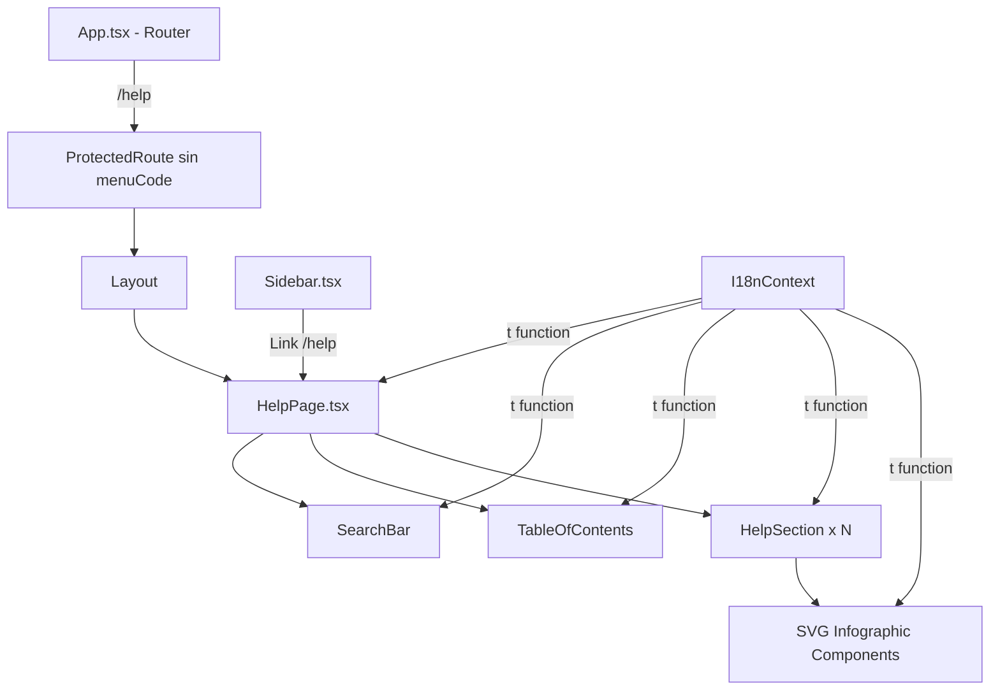

# Documento de Diseño — Centro de Ayuda (Help Center)

## Resumen

El Centro de Ayuda es una página frontend-only dentro de InvestIQ que proporciona documentación navegable sobre todos los módulos de la plataforma. Se implementa como una nueva ruta `/help` accesible para cualquier usuario autenticado (sin requerir permisos específicos), con un enlace en el Sidebar. La página incluye una barra de búsqueda con debounce, una tabla de contenidos con scroll tracking, secciones de documentación por módulo, e infografías SVG inline. Todo el contenido usa el sistema i18n existente con claves `help.*`.

No se requieren cambios en el backend excepto agregar las traducciones al archivo `seedTranslations.ts`.

## Arquitectura

La feature se integra en la arquitectura frontend existente de React + TypeScript + Tailwind CSS + Vite:



### Decisiones de Diseño

1. **Página única con secciones**: En lugar de múltiples páginas, todo el contenido vive en una sola página con scroll. Esto simplifica la búsqueda y navegación, y es consistente con centros de ayuda estándar.

2. **Sin menuCode en ProtectedRoute**: La ruta `/help` usa `<ProtectedRoute>` sin `menuCode` ni `permissionType`, lo que permite acceso a cualquier usuario autenticado (el componente solo verifica `isAuthenticated` cuando no se pasa menuCode).

3. **Sidebar sin menuCode filter**: El enlace de ayuda se agrega directamente en el JSX del Sidebar (fuera del array `menuItems` filtrado por permisos), garantizando visibilidad universal. Se coloca justo antes del botón de logout.

4. **Búsqueda client-side con debounce**: El filtrado se hace sobre el contenido ya renderizado usando un estado de búsqueda con debounce de 300ms. Cada sección tiene un `searchableText` que se compara case-insensitive contra el query.

5. **Scroll tracking con IntersectionObserver**: Para resaltar la sección activa en la tabla de contenidos, se usa `IntersectionObserver` en lugar de scroll event listeners, lo cual es más performante.

6. **SVG infographics como componentes React**: Las infografías son componentes funcionales que reciben `t()` como prop y renderizan SVG inline con textos localizados. Usan los colores CSS variables del tema (`var(--color-accent)`, `var(--color-primary)`, etc.).

## Componentes e Interfaces

### Estructura de Archivos

```
frontend/src/
├── pages/
│   └── HelpPage.tsx              # Página principal del centro de ayuda
├── components/
│   └── help/
│       ├── HelpSearchBar.tsx      # Barra de búsqueda con debounce
│       ├── HelpTableOfContents.tsx # Tabla de contenidos lateral
│       ├── HelpSection.tsx        # Wrapper de sección individual
│       └── infographics/
│           ├── BudgetFlowInfographic.tsx      # Flujo Plan → Computado
│           ├── TransactionFlowInfographic.tsx  # Compensación transacciones
│           ├── ApprovalFlowInfographic.tsx     # Flujo de aprobaciones
│           └── RolesPermissionsInfographic.tsx # Usuarios-Roles-Permisos
backend/src/
└── seedTranslations.ts           # Agregar claves help.*
```

### Interfaces TypeScript

```typescript
// Definición de una sección de ayuda
interface HelpSectionDef {
  id: string;                    // ID único para anchor (e.g. "budget-calculation")
  titleKey: string;              // Clave i18n para el título
  contentKeys: string[];         // Claves i18n para párrafos de contenido
  infographic?: React.ComponentType<InfographicProps>; // Componente SVG opcional
}

// Props para componentes de infografía SVG
interface InfographicProps {
  t: (key: string) => string;    // Función de traducción
}

// Props del componente HelpSearchBar
interface HelpSearchBarProps {
  value: string;
  onChange: (value: string) => void;
}

// Props del componente HelpTableOfContents
interface HelpTableOfContentsProps {
  sections: HelpSectionDef[];
  activeSectionId: string | null;
  onSectionClick: (id: string) => void;
}

// Props del componente HelpSection
interface HelpSectionProps {
  section: HelpSectionDef;
  ref: React.Ref<HTMLElement>;
}
```

### Componente HelpPage.tsx

Componente principal que orquesta la página:

- Mantiene estado `searchQuery` (string) y `debouncedQuery` (con 300ms debounce)
- Define el array de `HelpSectionDef[]` con todas las secciones
- Filtra secciones basándose en `debouncedQuery` comparando contra los textos traducidos (título + contenido)
- Usa `IntersectionObserver` para trackear qué sección está visible y actualizar `activeSectionId`
- Layout: en pantallas `lg+`, tabla de contenidos sticky a la izquierda (w-64) + contenido a la derecha. En pantallas pequeñas, tabla de contenidos colapsable arriba + contenido full-width.

### Componente HelpSearchBar.tsx

- Input con ícono de lupa (`HiOutlineMagnifyingGlass`)
- Placeholder localizado con `t('help.searchPlaceholder')`
- `aria-label` localizado con `t('help.searchAriaLabel')`
- Emite `onChange` en cada keystroke; el debounce se maneja en el padre

### Componente HelpTableOfContents.tsx

- Renderiza `<nav>` con lista de enlaces
- Cada enlace muestra el título traducido de la sección
- La sección activa se resalta con `text-accent font-semibold` y un borde izquierdo `border-l-2 border-accent`
- Click ejecuta `document.getElementById(sectionId)?.scrollIntoView({ behavior: 'smooth' })`
- En mobile, se muestra como un dropdown colapsable

### Componente HelpSection.tsx

- Renderiza `<section>` con `id={section.id}` y `ref` para IntersectionObserver
- Título como `<h2>` con el texto traducido
- Párrafos de contenido como `<p>` con textos traducidos
- Si tiene infographic, renderiza el componente SVG debajo del contenido

### Componentes de Infografía SVG

Cada infografía es un componente React que renderiza `<svg>` inline:
- Usa `viewBox` para ser responsive (width="100%")
- Colores del tema via CSS variables: `var(--color-accent)`, `var(--color-primary)`, `#111827` (sidebar)
- Textos dentro del SVG usan `t()` para localización
- Mínimo 4 infografías: BudgetFlow, TransactionFlow, ApprovalFlow, RolesPermissions

### Integración con Sidebar.tsx

Se agrega un enlace fijo al Help Center justo antes del botón de logout, fuera del sistema de `menuItems` filtrado por permisos:

```tsx
// Dentro del Sidebar, antes del bloque de logout
<Link to="/help" ...>
  <HiOutlineQuestionMarkCircle className="w-5 h-5" />
  {!collapsed && <span>{t('menu.help') || 'Ayuda'}</span>}
</Link>
```

### Integración con App.tsx

Nueva ruta sin menuCode:

```tsx
<Route path="/help" element={
  <ProtectedRoute>
    <Layout><HelpPage /></Layout>
  </ProtectedRoute>
} />
```

## Modelos de Datos

Esta feature no introduce modelos de datos nuevos en la base de datos. Los únicos datos son:

### Traducciones (seedTranslations.ts)

Se agregan entradas al array `translations` en `seedTranslations.ts` con categoría `'help'`:

```typescript
{ key: 'menu.help', es: 'Ayuda', en: 'Help', category: 'menu' },
{ key: 'help.title', es: 'Centro de Ayuda', en: 'Help Center', category: 'help' },
{ key: 'help.searchPlaceholder', es: 'Buscar en la ayuda...', en: 'Search help...', category: 'help' },
{ key: 'help.searchAriaLabel', es: 'Buscar contenido de ayuda', en: 'Search help content', category: 'help' },
{ key: 'help.noResults', es: 'No se encontraron resultados para', en: 'No results found for', category: 'help' },
// ... ~150+ claves help.section.*.title y help.section.*.description.*
```

### Definición de Secciones (constante en HelpPage.tsx)

Array estático de `HelpSectionDef[]` que define el orden y contenido de las secciones:

| id | titleKey | Infographic |
|---|---|---|
| `budget-calculation` | `help.section.budgetCalc.title` | BudgetFlowInfographic |
| `dashboard` | `help.section.dashboard.title` | DashboardInfographic (SVG layout) |
| `budgets` | `help.section.budgets.title` | BudgetLineInfographic |
| `budget-compare` | `help.section.budgetCompare.title` | — |
| `savings` | `help.section.savings.title` | SavingsEffectInfographic |
| `deferrals` | `help.section.deferrals.title` | — |
| `approvals` | `help.section.approvals.title` | ApprovalFlowInfographic |
| `expenses` | `help.section.expenses.title` | — |
| `transactions` | `help.section.transactions.title` | TransactionFlowInfographic |
| `exchange-rates` | `help.section.exchangeRates.title` | — |
| `reports` | `help.section.reports.title` | — |
| `detailed-reports` | `help.section.detailedReports.title` | — |
| `configuration` | `help.section.configuration.title` | — |
| `master-data` | `help.section.masterData.title` | — |
| `users-roles` | `help.section.usersRoles.title` | RolesPermissionsInfographic |
| `translations` | `help.section.translations.title` | — |
| `audit` | `help.section.audit.title` | — |


## Propiedades de Correctitud

*Una propiedad es una característica o comportamiento que debe mantenerse verdadero en todas las ejecuciones válidas de un sistema — esencialmente, una declaración formal sobre lo que el sistema debe hacer. Las propiedades sirven como puente entre especificaciones legibles por humanos y garantías de correctitud verificables por máquina.*

### Propiedad 1: El filtrado de búsqueda retorna exactamente las secciones que coinciden

*Para cualquier* query de búsqueda y cualquier conjunto de secciones de ayuda, las secciones visibles después de filtrar deben ser exactamente aquellas cuyo título traducido o contenido traducido contiene el query (comparación case-insensitive). Cuando el query es vacío, todas las secciones deben ser visibles.

**Valida: Requisitos 2.2, 2.3, 3.4**

### Propiedad 2: Todo el contenido renderizado usa el sistema i18n

*Para cualquier* sección de ayuda renderizada en la página, todos los textos visibles (títulos, párrafos, placeholders, labels de SVG) deben provenir de llamadas a `t()` del I18nContext, y no contener strings hardcodeados en español o inglés.

**Valida: Requisitos 4.8, 5.4, 6.5, 7.3, 8.4, 9.3, 10.4, 11.3, 12.5, 13.3, 14.3, 15.3, 16.4, 17.3, 18.4, 19.1**

### Propiedad 3: Cambio de locale actualiza todo el contenido

*Para cualquier* par de locales soportados (es, en) y cualquier sección visible, cambiar el locale del I18nContext debe resultar en que todos los textos de la página se actualicen al nuevo idioma sin recargar la página.

**Valida: Requisito 19.2**

### Propiedad 4: Las claves de traducción usan el prefijo help.*

*Para cualquier* clave de traducción utilizada por los componentes del Help Center (excepto `menu.help`), la clave debe comenzar con el prefijo `help.`.

**Valida: Requisito 19.3**

### Propiedad 5: Las infografías SVG usan colores del tema y son responsive

*Para cualquier* componente de infografía SVG renderizado, el elemento `<svg>` debe usar `viewBox` para responsividad (width="100%"), y los colores utilizados deben provenir de las CSS variables del tema (`var(--color-accent)`, `var(--color-primary)`, etc.) o colores consistentes con el tema.

**Valida: Requisito 18.3**

### Propiedad 6: Las secciones usan elementos HTML semánticos

*Para cualquier* sección de ayuda renderizada, debe estar envuelta en un elemento `<section>`, su título debe ser un `<h2>`, la tabla de contenidos debe usar `<nav>`, y los subtítulos deben usar `<h3>`.

**Valida: Requisito 20.2**

## Manejo de Errores

| Escenario | Comportamiento |
|---|---|
| Traducciones no cargadas | Se muestra la clave i18n como fallback (comportamiento existente de `t()`) |
| Búsqueda sin resultados | Se muestra mensaje localizado "No se encontraron resultados para '[término]'" |
| IntersectionObserver no soportado | La tabla de contenidos funciona sin resaltado automático (degradación elegante) |
| Sección con id no encontrada | `scrollIntoView` falla silenciosamente, sin crash |
| Locale no soportado | Se usa el locale por defecto (es) del I18nContext existente |

No se requiere manejo de errores de red ya que la página es puramente frontend sin llamadas API (las traducciones ya están cargadas por el I18nContext al momento de navegar a la página).

## Estrategia de Testing

### Enfoque Dual: Unit Tests + Property-Based Tests

Se utilizan ambos enfoques de forma complementaria:

- **Unit tests** (Vitest + React Testing Library): Para ejemplos específicos, edge cases, y verificación de integración de componentes.
- **Property-based tests** (fast-check + Vitest): Para propiedades universales que deben cumplirse para todos los inputs posibles.

### Librería de Property-Based Testing

Se usa **fast-check** (`fc`) integrado con Vitest. Cada test de propiedad ejecuta mínimo 100 iteraciones.

### Unit Tests

1. **Renderizado del Sidebar**: Verificar que el enlace de ayuda aparece con ícono y label correcto.
2. **Ruta /help accesible**: Verificar que la ruta no requiere menuCode.
3. **Búsqueda sin resultados**: Verificar que se muestra el mensaje de "no results".
4. **Debounce de 300ms**: Verificar que el filtrado no se ejecuta inmediatamente.
5. **SVG infographics presentes**: Verificar que las 4 infografías requeridas se renderizan.
6. **Scroll suave al hacer clic en TOC**: Verificar que `scrollIntoView` se llama con `{ behavior: 'smooth' }`.
7. **Navegación por teclado**: Verificar que Tab y Enter funcionan en la TOC.
8. **aria-label en SearchBar**: Verificar que el input tiene aria-label localizado.
9. **Budget Calculation es la primera sección**: Verificar el orden de las secciones.

### Property-Based Tests

Cada test referencia su propiedad del documento de diseño:

1. **Feature: help-center, Property 1: Search filtering returns exactly matching sections**
   - Genera queries aleatorios y conjuntos de secciones con contenido aleatorio
   - Verifica que el resultado del filtrado coincide con la expectativa case-insensitive
   - Mínimo 100 iteraciones

2. **Feature: help-center, Property 4: Translation keys use help.* prefix**
   - Genera secciones aleatorias del array de definiciones
   - Verifica que todas las claves i18n usadas comienzan con `help.`
   - Mínimo 100 iteraciones

3. **Feature: help-center, Property 6: Sections use semantic HTML elements**
   - Genera secciones aleatorias y las renderiza
   - Verifica que cada sección usa `<section>`, `<h2>`, y la TOC usa `<nav>`
   - Mínimo 100 iteraciones

Las propiedades 2, 3 y 5 se validan mejor con unit tests de integración (requieren contexto React completo con I18nProvider y DOM rendering) ya que dependen de la interacción con el contexto de React y CSS variables del navegador.
