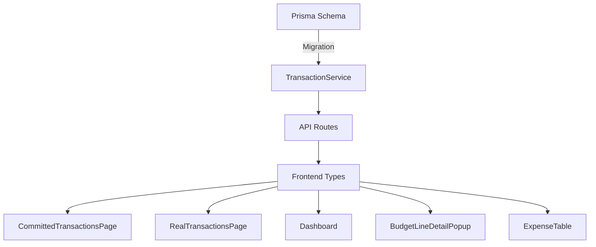

# Documento de Diseño: Compensación Parcial

## Visión General

Transformar el modelo de compensación 1:1 actual a un modelo N:1 donde múltiples transacciones reales pueden compensar parcialmente una transacción comprometida. Se agrega un campo `compensatedAmount` a la tabla Transaction, se elimina la restricción `@unique` de `compensatedById`, y se actualizan todas las vistas del frontend para mostrar saldo pendiente.

## Arquitectura

El cambio es vertical a través de todas las capas:



### Cambios por capa:
1. **Schema**: Agregar `compensatedAmount`, eliminar `@unique` de `compensatedById`
2. **Backend Service**: Lógica de acumulación/resta de compensatedAmount
3. **Frontend Types**: Agregar `compensatedAmount` a la interfaz Transaction
4. **Frontend Pages/Components**: Mostrar saldo pendiente en todas las vistas

## Componentes e Interfaces

### 1. Prisma Schema (schema.prisma)

Cambios en el modelo Transaction:
```prisma
model Transaction {
  // ... campos existentes ...
  compensatedById    String?          // ELIMINAR @unique
  compensatedAmount  Decimal          @default(0) @db.Decimal(15, 2)  // NUEVO
  // ... resto igual ...
}
```

La eliminación de `@unique` en `compensatedById` permite que múltiples REAL referencien la misma COMMITTED. Se elimina la relación inversa `compensates Transaction?` ya que ahora es 1:N.

### 2. TransactionService (TransactionService.ts)

**createTransaction**: Al crear una REAL con `committedTransactionId`:
- Validar que la comprometida existe y es tipo COMMITTED
- Validar que `compensatedAmount < transactionValue` (aún tiene saldo)
- Sumar `transactionValue` de la real al `compensatedAmount` de la comprometida
- Si `compensatedAmount + realValue >= transactionValue`, marcar `isCompensated = true`

**deleteTransaction**: Al eliminar una REAL que compensaba:
- Restar `transactionValue` de la real del `compensatedAmount` de la comprometida
- Si `compensatedAmount - realValue < transactionValue`, marcar `isCompensated = false`
- Garantizar `compensatedAmount >= 0` con `Math.max(0, ...)`

**getUncompensatedCommitted**: Cambiar filtro de `isCompensated: false` a consulta raw o computed donde `compensatedAmount < transactionValue`

### 3. Frontend Transaction Interface

```typescript
interface Transaction {
  // ... campos existentes ...
  compensatedAmount: number;  // NUEVO
}
```

### 4. Componentes Frontend

**CommittedTransactionsPage**: Agregar columnas "Compensado" y "Pendiente". Badge triestado: No (amarillo), Parcial (naranja), Sí (verde).

**RealTransactionsPage**: En el picker de comprometidas, mostrar saldo pendiente. Pre-llenar valor con saldo pendiente. Advertencia si monto excede saldo.

**Dashboard**: El cálculo de comprometido usa `transactionValue - compensatedAmount` para cada comprometida (saldo pendiente). Nuevo indicador "Pendiente por Compensar".

**BudgetLineDetailPopup**: Columnas de compensado/pendiente en tabla de comprometidas. Totales mensuales usan saldo pendiente.

**ExpenseTable**: En COMPARISON view, el cálculo de committed usa saldo pendiente en lugar de filtrar `!isCompensated`.

## Modelos de Datos

### Transaction (cambios)

| Campo | Tipo | Cambio |
|-------|------|--------|
| compensatedById | String? | Eliminar @unique |
| compensatedAmount | Decimal(15,2) | Nuevo, default 0 |
| compensates | Relation | Eliminar (ya no es 1:1) |

### Migración de datos existentes

Las transacciones comprometidas que ya están marcadas como `isCompensated = true` necesitan que su `compensatedAmount` se inicialice con su `transactionValue`. Las que tienen `isCompensated = false` mantienen `compensatedAmount = 0`.

```sql
UPDATE "Transaction" 
SET "compensatedAmount" = "transactionValue" 
WHERE "isCompensated" = true AND type = 'COMMITTED';
```

