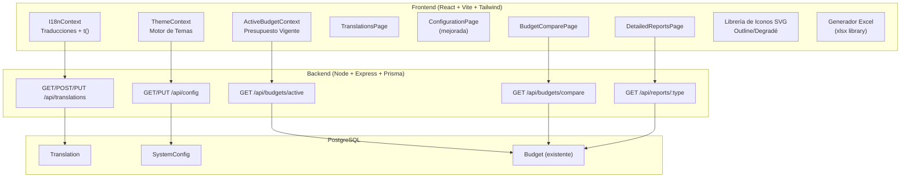
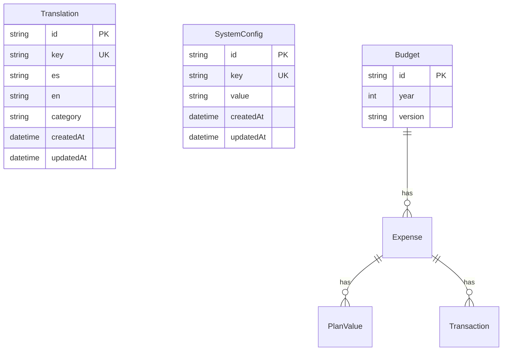

# Documento de Diseño: Mejoras de Plataforma

## Visión General

Este diseño cubre cinco mejoras principales para la plataforma Tech Budget Management:

1. **Internacionalización (i18n)**: Sistema de traducciones con tabla en base de datos, contexto React con función `t()`, y UI de administración de traducciones.
2. **UI/UX - Colores y Logo**: Motor de temas mejorado con preview popup, migración de emojis a iconos SVG outline/degradé, y logo de plataforma.
3. **Presupuesto Vigente por Defecto**: Endpoint y hook que determinan automáticamente el presupuesto vigente para todas las secciones excepto presupuestos.
4. **Comparación de Presupuestos**: Nueva página con selección de dos presupuestos del mismo año, cálculo de diferencias y visualización gráfica/tabular.
5. **Reportes Detallados con Excel**: 10 reportes con filtros específicos, visualización en tabla y exportación a XLSX.

La arquitectura existente (Node/Express/Prisma backend + React/Vite/Tailwind frontend) se mantiene. Se agregan nuevos modelos Prisma, endpoints REST, y componentes React.

## Arquitectura



### Decisiones de Diseño

1. **i18n en base de datos vs archivos JSON**: Se usa base de datos para permitir edición desde UI sin redespliegue. Las traducciones se cargan al iniciar y se cachean en el contexto React.
2. **Iconos SVG inline vs librería externa**: Se usa `react-icons` (paquete `hi2` - Heroicons outline) para iconos consistentes tipo outline. El logo se crea como SVG personalizado.
3. **Presupuesto vigente como contexto**: Se crea un `ActiveBudgetContext` que carga el presupuesto vigente una vez y lo comparte entre todas las páginas.
4. **Comparación en frontend**: El backend retorna los datos de ambos presupuestos con sus gastos y plan values; el cálculo de diferencias se hace en frontend para flexibilidad.
5. **Excel con xlsx**: Se usa la librería `xlsx` (SheetJS) en frontend para generar archivos XLSX con formato apropiado.

## Componentes e Interfaces

### 1. Sistema i18n

**Backend - TranslationService:**
```typescript
class TranslationService {
  async getAll(): Promise<Translation[]>
  async getByLocale(locale: string): Promise<Record<string, string>>
  async create(data: { key: string; es: string; en: string }): Promise<Translation>
  async update(id: string, data: Partial<Translation>): Promise<Translation>
  async delete(id: string): Promise<void>
  async search(query: string): Promise<Translation[]>
}
```

**Backend - ConfigService:**
```typescript
class ConfigService {
  async get(key: string): Promise<string | null>
  async set(key: string, value: string): Promise<SystemConfig>
  async getLocale(): Promise<string>  // retorna "es" o "en"
  async setLocale(locale: string): Promise<void>
}
```

**Frontend - I18nContext:**
```typescript
interface I18nContextType {
  locale: string;
  setLocale: (locale: string) => Promise<void>;
  t: (key: string) => string;
  translations: Record<string, Record<string, string>>;
  loading: boolean;
}
```

**Rutas API:**
- `GET /api/translations` - Listar todas las traducciones (con paginación y búsqueda)
- `POST /api/translations` - Crear traducción
- `PUT /api/translations/:id` - Actualizar traducción
- `DELETE /api/translations/:id` - Eliminar traducción
- `GET /api/translations/locale/:locale` - Obtener mapa clave-valor por locale
- `GET /api/config/:key` - Obtener valor de configuración
- `PUT /api/config/:key` - Actualizar valor de configuración

### 2. Motor de Temas Mejorado

**Frontend - ThemeContext mejorado:**
```typescript
interface Theme {
  id: string;
  name: string;
  primary: string;
  sidebar: string;
  accent: string;
  gradientStart: string;
  gradientEnd: string;
}

interface ThemeContextType {
  currentTheme: Theme;
  applyTheme: (themeId: string) => void;
  themes: Theme[];
}
```

**Preview_Tema Component:**
```typescript
interface ThemePreviewProps {
  theme: Theme;
  visible: boolean;
  anchorEl: HTMLElement | null;
}
```

### 3. Presupuesto Vigente

**Backend - Endpoint:**
- `GET /api/budgets/active` - Retorna el presupuesto vigente (versión más reciente del año actual, o el más reciente disponible)

**Frontend - ActiveBudgetContext:**
```typescript
interface ActiveBudgetContextType {
  activeBudget: Budget | null;
  loading: boolean;
  refresh: () => Promise<void>;
}
```

### 4. Comparador de Presupuestos

**Backend - Endpoint:**
- `GET /api/budgets/compare?budgetA={id}&budgetB={id}` - Retorna datos completos de ambos presupuestos con gastos y plan values

**Frontend - Interfaces de Comparación:**
```typescript
interface BudgetComparisonResult {
  budgetA: Budget;
  budgetB: Budget;
  summary: ComparisonSummary;
  rows: ComparisonRow[];
}

interface ComparisonSummary {
  totalA: number;
  totalB: number;
  difference: number;
  percentChange: number;
  newExpenses: number;
  removedExpenses: number;
  modifiedExpenses: number;
}

interface ComparisonRow {
  expenseCode: string;
  expenseDescription: string;
  status: 'new' | 'removed' | 'modified' | 'unchanged';
  monthlyA: number[];  // 12 meses
  monthlyB: number[];  // 12 meses
  totalA: number;
  totalB: number;
  difference: number;
  percentChange: number;
}
```

### 5. Reportes Detallados

**Backend - Endpoints:**
- `GET /api/reports/:type` - Genera datos del reporte con filtros como query params

**Frontend - Interfaces:**
```typescript
interface ReportDefinition {
  id: string;
  name: string;
  description: string;
  filters: ReportFilter[];
  columns: ReportColumn[];
}

interface ReportFilter {
  key: string;
  label: string;
  type: 'select' | 'dateRange' | 'monthRange';
  options?: { value: string; label: string }[];
}

interface ReportColumn {
  key: string;
  label: string;
  type: 'text' | 'number' | 'currency' | 'percentage';
  align?: 'left' | 'right' | 'center';
}
```

**10 Reportes Definidos:**
1. Resumen Ejecutivo de Presupuesto
2. Ejecución Presupuestaria por Gasto
3. Comparativo Plan vs Real por Mes
4. Gastos por Empresa Financiera
5. Gastos por Dirección Tecnológica
6. Gastos por Área Usuaria
7. Transacciones Detalladas por Período
8. Análisis de Variaciones
9. Reporte de Ahorros y Diferidos
10. Proyección de Cierre Anual

## Modelos de Datos

### Nuevos Modelos Prisma

```prisma
model Translation {
  id        String   @id @default(uuid())
  key       String   @unique
  es        String
  en        String
  category  String   @default("general")
  createdAt DateTime @default(now())
  updatedAt DateTime @updatedAt
  
  @@index([key])
  @@index([category])
}

model SystemConfig {
  id        String   @id @default(uuid())
  key       String   @unique
  value     String
  createdAt DateTime @default(now())
  updatedAt DateTime @updatedAt
  
  @@index([key])
}
```

### Seed de Traducciones Iniciales

Las traducciones iniciales se poblarán con un script de seed que incluye:
- Menús del sidebar (Dashboard, Presupuestos, Gastos, etc.)
- Etiquetas de formularios (Guardar, Cancelar, Editar, etc.)
- Mensajes del sistema (errores, confirmaciones, etc.)
- Encabezados de tablas y columnas
- Nombres de meses
- Textos de filtros y botones

### Diagrama de Relaciones




## Propiedades de Correctitud

*Una propiedad es una característica o comportamiento que debe mantenerse verdadero en todas las ejecuciones válidas de un sistema — esencialmente, una declaración formal sobre lo que el sistema debe hacer. Las propiedades sirven como puente entre especificaciones legibles por humanos y garantías de correctitud verificables por máquinas.*

### Propiedad 1: Round-trip de traducciones
*Para cualquier* traducción con clave, texto en español y texto en inglés válidos, crear la traducción y luego consultarla por su clave debe retornar los mismos valores de texto en español e inglés.
**Valida: Requisitos 2.1, 1.4, 3.3**

### Propiedad 2: Validación de clave de traducción
*Para cualquier* cadena vacía o compuesta solo de espacios en blanco como clave, la creación de una traducción debe ser rechazada. *Para cualquier* clave que ya existe en la tabla, intentar crear otra traducción con la misma clave debe producir un error.
**Valida: Requisitos 2.2, 3.4, 3.5**

### Propiedad 3: Consulta de traducción por locale
*Para cualquier* traducción almacenada con textos en español e inglés, consultar con locale "es" debe retornar el texto en español, y consultar con locale "en" debe retornar el texto en inglés.
**Valida: Requisitos 2.3**

### Propiedad 4: Clave de traducción inexistente retorna la clave
*Para cualquier* cadena que no existe como clave en la tabla de traducciones, la función `t(clave)` debe retornar la misma cadena como texto de respaldo.
**Valida: Requisitos 2.4**

### Propiedad 5: Búsqueda de traducciones retorna resultados coincidentes
*Para cualquier* conjunto de traducciones y cualquier cadena de búsqueda, todos los resultados retornados deben contener la cadena de búsqueda en la clave, el texto en español o el texto en inglés.
**Valida: Requisitos 3.2**

### Propiedad 6: Agrupación de traducciones por locale
*Para cualquier* conjunto de traducciones, agruparlas en un mapa indexado por locale debe producir un mapa donde cada clave mapea al texto correcto del locale correspondiente, y el número de entradas en cada locale debe ser igual al número total de traducciones.
**Valida: Requisitos 4.5**

### Propiedad 7: Persistencia de tema round-trip
*Para cualquier* tema válido, guardarlo en localStorage y luego leerlo debe retornar el mismo identificador de tema.
**Valida: Requisitos 5.3**

### Propiedad 8: Identificación del presupuesto vigente
*Para cualquier* conjunto de presupuestos con diferentes años y versiones, el presupuesto vigente debe ser el que tiene el año actual y la fecha de creación más reciente. Si no existe presupuesto del año actual, debe ser el presupuesto con la fecha de creación más reciente de cualquier año.
**Valida: Requisitos 8.1, 8.3**

### Propiedad 9: Filtro de presupuestos por año
*Para cualquier* conjunto de presupuestos y cualquier año seleccionado, el filtro debe retornar exactamente los presupuestos cuyo año coincide con el año seleccionado, sin incluir presupuestos de otros años.
**Valida: Requisitos 9.2**

### Propiedad 10: Cálculo de resumen de comparación
*Para cualesquiera* dos presupuestos con sus gastos y valores plan, el resumen de comparación debe calcular correctamente: totalA = suma de todos los plan values del presupuesto A, totalB = suma de todos los plan values del presupuesto B, diferencia = totalB - totalA, y porcentaje de cambio = ((totalB - totalA) / totalA) * 100.
**Valida: Requisitos 10.1**

### Propiedad 11: Clasificación de gastos en comparación
*Para cualesquiera* dos conjuntos de gastos de dos presupuestos, cada gasto debe clasificarse correctamente como: "nuevo" si existe solo en B, "eliminado" si existe solo en A, "modificado" si existe en ambos pero con valores diferentes, "sin cambios" si existe en ambos con valores idénticos.
**Valida: Requisitos 10.3, 11.3**

### Propiedad 12: Cálculo de diferencia por celda
*Para cualesquiera* dos valores numéricos de celdas correspondientes, la diferencia absoluta debe ser valorB - valorA, y la diferencia porcentual debe ser ((valorB - valorA) / valorA) * 100 cuando valorA es distinto de cero.
**Valida: Requisitos 11.5**

### Propiedad 13: Asignación de color por diferencia
*Para cualquier* diferencia numérica entre dos valores, si la diferencia es positiva el color asignado debe ser verde, si es negativa debe ser rojo, y si es cero no debe resaltarse.
**Valida: Requisitos 10.4, 11.2**

### Propiedad 14: Descripción textual incluye todas las diferencias
*Para cualquier* resultado de comparación con diferencias, la descripción textual generada debe mencionar cada gasto que tiene diferencias, incluyendo el código del gasto y los valores que cambiaron.
**Valida: Requisitos 11.4**

### Propiedad 15: Filtro de reportes produce subconjunto correcto
*Para cualquier* conjunto de datos de reporte y cualquier combinación de filtros, todos los registros retornados deben cumplir con todos los criterios de filtro aplicados, y ningún registro que cumpla los criterios debe ser excluido.
**Valida: Requisitos 13.1**

### Propiedad 16: Round-trip de generación Excel
*Para cualquier* conjunto de datos de reporte, generar un archivo Excel y leer sus datos debe producir valores equivalentes a los datos originales, incluyendo encabezados de columna y valores numéricos.
**Valida: Requisitos 14.1, 14.2, 14.3**

### Propiedad 17: Nombre de archivo Excel sigue convención
*Para cualquier* nombre de reporte y fecha, el nombre del archivo generado debe seguir el patrón "reporte_{nombre}_{fecha}.xlsx" donde nombre no contiene espacios y fecha tiene formato YYYY-MM-DD.
**Valida: Requisitos 14.4**

### Propiedad 18: Configuración de locale solo acepta valores válidos
*Para cualquier* cadena que no sea "es" ni "en", intentar establecerla como locale debe ser rechazado. Solo "es" y "en" deben ser aceptados como valores válidos.
**Valida: Requisitos 1.1**

## Manejo de Errores

| Escenario | Comportamiento |
|-----------|---------------|
| Clave de traducción duplicada | Retornar error 409 Conflict con mensaje descriptivo |
| Clave de traducción vacía | Retornar error 400 Bad Request |
| Locale inválido (no es "es" ni "en") | Retornar error 400 Bad Request |
| Traducción no encontrada por ID | Retornar error 404 Not Found |
| Presupuesto no encontrado para comparación | Retornar error 404 Not Found |
| Presupuestos de años diferentes en comparación | Retornar error 400 Bad Request con mensaje explicativo |
| Error al generar Excel | Mostrar notificación de error en UI, no descargar archivo |
| Fallo de conexión al cargar traducciones | Usar traducciones cacheadas si existen, mostrar error si no |
| Configuración de sistema no encontrada | Usar valor por defecto ("es" para locale, "default" para tema) |
| Reporte sin datos para filtros seleccionados | Mostrar mensaje "No se encontraron resultados" en la tabla |

## Estrategia de Testing

### Testing Unitario
- Validación de datos de traducción (clave única, no vacía)
- Cálculos de comparación de presupuestos (totales, diferencias, porcentajes)
- Clasificación de gastos (nuevo, eliminado, modificado)
- Función `t()` con claves existentes e inexistentes
- Lógica de determinación de presupuesto vigente
- Generación de nombres de archivo Excel
- Filtrado de datos de reportes

### Testing Basado en Propiedades
- Librería: `fast-check` para TypeScript
- Mínimo 100 iteraciones por propiedad
- Cada test debe referenciar su propiedad del documento de diseño
- Formato de tag: **Feature: platform-enhancements, Property {N}: {título}**

### Enfoque Dual
- Los tests unitarios cubren ejemplos específicos, casos borde y condiciones de error
- Los tests de propiedades verifican propiedades universales con entradas generadas aleatoriamente
- Ambos son complementarios: los unitarios atrapan bugs concretos, las propiedades verifican correctitud general

### Configuración
- Framework: Vitest (ya configurado en el proyecto)
- PBT: fast-check
- Cada propiedad de correctitud se implementa como un único test de propiedades
- Los tests se organizan junto a los módulos que prueban
