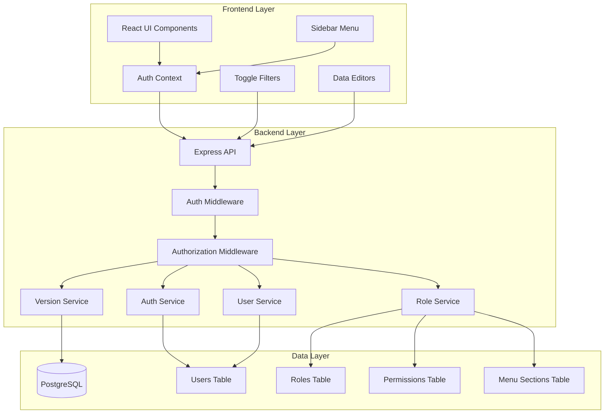
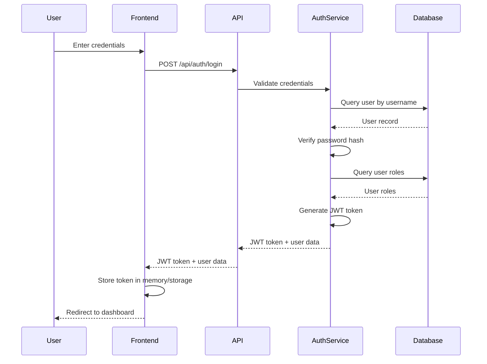
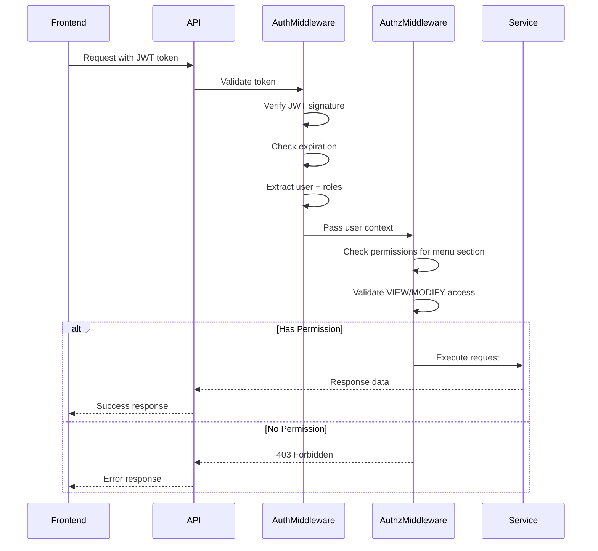

# Design Document: User Authentication and Authorization

## Overview

This design implements a comprehensive authentication and authorization system for the tech budget management application. The system transitions from an open-access model to a secure, role-based access control (RBAC) system with JWT-based session management. The design includes database schema extensions, authentication middleware, role-based permissions, UI navigation improvements, and enhanced filtering capabilities.

The authentication system uses JWT tokens for stateless session management, while the authorization system implements granular permissions at the menu section level with VIEW and MODIFY access rights. The UI is enhanced with a sidebar navigation menu and toggle-based filters for improved user experience.

## Architecture

### System Components



### Authentication Flow



### Authorization Flow



## Components and Interfaces

### Database Schema Extensions

#### User Table
```typescript
model User {
  id           String      @id @default(uuid())
  username     String      @unique
  passwordHash String
  email        String      @unique
  fullName     String
  isActive     Boolean     @default(true)
  userRoles    UserRole[]
  createdAt    DateTime    @default(now())
  updatedAt    DateTime    @updatedAt
}
```

#### Role Table
```typescript
model Role {
  id          String       @id @default(uuid())
  code        String       @unique
  name        String
  description String?
  userRoles   UserRole[]
  permissions Permission[]
  createdAt   DateTime     @default(now())
  updatedAt   DateTime     @updatedAt
}
```

#### UserRole Junction Table
```typescript
model UserRole {
  id        String   @id @default(uuid())
  userId    String
  user      User     @relation(fields: [userId], references: [id], onDelete: Cascade)
  roleId    String
  role      Role     @relation(fields: [roleId], references: [id], onDelete: Cascade)
  createdAt DateTime @default(now())
  
  @@unique([userId, roleId])
  @@index([userId])
  @@index([roleId])
}
```

#### MenuSection Table
```typescript
model MenuSection {
  id          String       @id @default(uuid())
  code        String       @unique
  name        String
  description String?
  order       Int
  permissions Permission[]
  createdAt   DateTime     @default(now())
  updatedAt   DateTime     @updatedAt
}
```

#### Permission Table
```typescript
model Permission {
  id            String      @id @default(uuid())
  roleId        String
  role          Role        @relation(fields: [roleId], references: [id], onDelete: Cascade)
  menuSectionId String
  menuSection   MenuSection @relation(fields: [menuSectionId], references: [id], onDelete: Cascade)
  canView       Boolean     @default(false)
  canModify     Boolean     @default(false)
  createdAt     DateTime    @default(now())
  updatedAt     DateTime    @updatedAt
  
  @@unique([roleId, menuSectionId])
  @@index([roleId])
  @@index([menuSectionId])
}
```

### Backend Interfaces

#### Authentication Service
```typescript
interface AuthService {
  // Authenticate user and generate JWT
  login(username: string, password: string): Promise<AuthResponse>;
  
  // Verify JWT token and extract user data
  verifyToken(token: string): Promise<UserContext>;
  
  // Hash password for storage
  hashPassword(password: string): Promise<string>;
  
  // Verify password against hash
  verifyPassword(password: string, hash: string): Promise<boolean>;
  
  // Generate JWT token
  generateToken(user: User, roles: Role[]): string;
}

interface AuthResponse {
  token: string;
  user: {
    id: string;
    username: string;
    email: string;
    fullName: string;
    roles: RoleInfo[];
  };
}

interface UserContext {
  userId: string;
  username: string;
  roles: RoleInfo[];
  permissions: PermissionMap;
}

interface RoleInfo {
  id: string;
  code: string;
  name: string;
}

interface PermissionMap {
  [menuCode: string]: {
    canView: boolean;
    canModify: boolean;
  };
}
```

#### User Service
```typescript
interface UserService {
  // Create new user
  createUser(input: CreateUserInput): Promise<User>;
  
  // Update user information
  updateUser(userId: string, input: UpdateUserInput): Promise<User>;
  
  // Activate/deactivate user
  setUserActive(userId: string, isActive: boolean): Promise<User>;
  
  // Assign roles to user
  assignRoles(userId: string, roleIds: string[]): Promise<void>;
  
  // Get user with roles
  getUserWithRoles(userId: string): Promise<UserWithRoles>;
  
  // List all users
  listUsers(): Promise<UserWithRoles[]>;
  
  // Get user by username
  getUserByUsername(username: string): Promise<User | null>;
}

interface CreateUserInput {
  username: string;
  password: string;
  email: string;
  fullName: string;
  roleIds: string[];
}

interface UpdateUserInput {
  email?: string;
  fullName?: string;
  password?: string;
}

interface UserWithRoles {
  id: string;
  username: string;
  email: string;
  fullName: string;
  isActive: boolean;
  roles: RoleInfo[];
  createdAt: string;
  updatedAt: string;
}
```

#### Role Service
```typescript
interface RoleService {
  // Create new role with permissions
  createRole(input: CreateRoleInput): Promise<Role>;
  
  // Update role information
  updateRole(roleId: string, input: UpdateRoleInput): Promise<Role>;
  
  // Delete role (if not assigned to users)
  deleteRole(roleId: string): Promise<void>;
  
  // Set permissions for role
  setPermissions(roleId: string, permissions: PermissionInput[]): Promise<void>;
  
  // Get role with permissions
  getRoleWithPermissions(roleId: string): Promise<RoleWithPermissions>;
  
  // List all roles
  listRoles(): Promise<RoleWithPermissions[]>;
  
  // Get user permissions (union of all role permissions)
  getUserPermissions(userId: string): Promise<PermissionMap>;
}

interface CreateRoleInput {
  code: string;
  name: string;
  description?: string;
  permissions: PermissionInput[];
}

interface UpdateRoleInput {
  name?: string;
  description?: string;
}

interface PermissionInput {
  menuSectionCode: string;
  canView: boolean;
  canModify: boolean;
}

interface RoleWithPermissions {
  id: string;
  code: string;
  name: string;
  description?: string;
  permissions: PermissionDetail[];
  createdAt: string;
  updatedAt: string;
}

interface PermissionDetail {
  menuSectionCode: string;
  menuSectionName: string;
  canView: boolean;
  canModify: boolean;
}
```

#### Budget Version Service
```typescript
interface BudgetVersionService {
  // Create new budget version from existing version
  createNewVersion(budgetId: string, changes: PlanValueChange[]): Promise<Budget>;
  
  // Get next version number
  getNextVersionNumber(year: number): Promise<number>;
  
  // Copy all data from previous version
  copyBudgetData(sourceBudgetId: string, targetBudgetId: string): Promise<void>;
  
  // Apply plan value changes to new version
  applyPlanValueChanges(budgetId: string, changes: PlanValueChange[]): Promise<void>;
}

interface PlanValueChange {
  expenseId: string;
  month: number;
  transactionCurrency: string;
  transactionValue: number;
  operation: 'CREATE' | 'UPDATE' | 'DELETE';
}
```

### Middleware

#### Authentication Middleware
```typescript
interface AuthMiddleware {
  // Extract and verify JWT token from request
  authenticate(req: Request, res: Response, next: NextFunction): void;
}

// Extends Express Request with user context
interface AuthenticatedRequest extends Request {
  user: UserContext;
}
```

#### Authorization Middleware
```typescript
interface AuthorizationMiddleware {
  // Check if user has VIEW permission for menu section
  requireView(menuSectionCode: string): RequestHandler;
  
  // Check if user has MODIFY permission for menu section
  requireModify(menuSectionCode: string): RequestHandler;
}
```

### Frontend Interfaces

#### Auth Context
```typescript
interface AuthContextType {
  user: AuthUser | null;
  token: string | null;
  login: (username: string, password: string) => Promise<void>;
  logout: () => void;
  hasPermission: (menuCode: string, type: 'VIEW' | 'MODIFY') => boolean;
  isAuthenticated: boolean;
}

interface AuthUser {
  id: string;
  username: string;
  email: string;
  fullName: string;
  roles: RoleInfo[];
  permissions: PermissionMap;
}
```

#### Sidebar Menu Component
```typescript
interface SidebarMenuProps {
  activeSection: string;
  onNavigate: (section: string) => void;
}

interface MenuItem {
  code: string;
  name: string;
  icon: React.ReactNode;
  path: string;
  canView: boolean;
}
```

#### Filter Toggle Component
```typescript
interface FilterToggleProps {
  label: string;
  value: string;
  isActive: boolean;
  onToggle: (value: string) => void;
}

interface FilterGroup {
  label: string;
  filters: FilterToggleProps[];
}
```

## Data Models

### JWT Token Payload
```typescript
interface JWTPayload {
  userId: string;
  username: string;
  roles: {
    id: string;
    code: string;
  }[];
  iat: number;  // Issued at
  exp: number;  // Expiration
}
```

### Menu Section Codes
```typescript
enum MenuSectionCode {
  DASHBOARD = 'DASHBOARD',
  PLAN_VALUES = 'PLAN_VALUES',
  COMMITTED_TRANSACTIONS = 'COMMITTED_TRANSACTIONS',
  REAL_TRANSACTIONS = 'REAL_TRANSACTIONS',
  EXPENSES = 'EXPENSES',
  MASTER_DATA = 'MASTER_DATA',
  METADATA_CONFIG = 'METADATA_CONFIG',
  EXCHANGE_RATES = 'EXCHANGE_RATES',
  USER_MANAGEMENT = 'USER_MANAGEMENT',
  ROLE_MANAGEMENT = 'ROLE_MANAGEMENT'
}
```

### Default Data

#### Default Admin User
```typescript
const DEFAULT_ADMIN = {
  username: 'admin',
  password: 'admin',  // Will be hashed
  email: 'admin@techbudget.local',
  fullName: 'System Administrator',
  isActive: true
};
```

#### Default Admin Role
```typescript
const DEFAULT_ADMIN_ROLE = {
  code: 'ADMIN',
  name: 'Administrator',
  description: 'Full system access with all permissions',
  permissions: [
    // All menu sections with VIEW and MODIFY
    { menuSectionCode: 'DASHBOARD', canView: true, canModify: true },
    { menuSectionCode: 'PLAN_VALUES', canView: true, canModify: true },
    { menuSectionCode: 'COMMITTED_TRANSACTIONS', canView: true, canModify: true },
    { menuSectionCode: 'REAL_TRANSACTIONS', canView: true, canModify: true },
    { menuSectionCode: 'EXPENSES', canView: true, canModify: true },
    { menuSectionCode: 'MASTER_DATA', canView: true, canModify: true },
    { menuSectionCode: 'METADATA_CONFIG', canView: true, canModify: true },
    { menuSectionCode: 'EXCHANGE_RATES', canView: true, canModify: true },
    { menuSectionCode: 'USER_MANAGEMENT', canView: true, canModify: true },
    { menuSectionCode: 'ROLE_MANAGEMENT', canView: true, canModify: true }
  ]
};
```

## Correctness Properties

*A property is a characteristic or behavior that should hold true across all valid executions of a system—essentially, a formal statement about what the system should do. Properties serve as the bridge between human-readable specifications and machine-verifiable correctness guarantees.*

